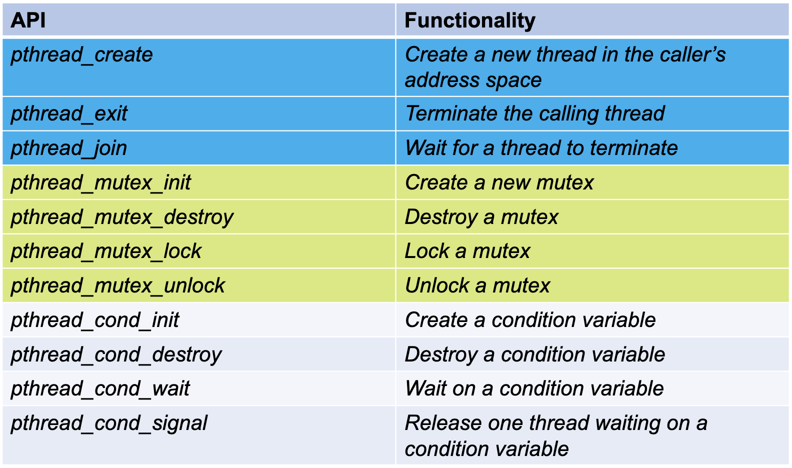

# Learning Objectives

## 1. Operating Systems

- **What are the three OS structures?**

  The three main structures of operating systems are:
  
  - *Monolithic kernel*: Operating system architecture where the entire OS is working in the kernel. This means that the system services operate in a large single process with full access to all of the system's hardware and memory.

  - *Microkernel*: Operating system architecture that keeps the core functionality of the OS minimal and runs most services in separate processes, usually in user space, outside of the kernel. 

  - *Hybrid kernel*: Operating system architecture that blends elements from both monolithic kernels and microkernels. It aims to provide a balance between efficiency and modularity by running som essential services (like device drivers and file management) in the kernel space for faster performance, and less critical services in user space. This structure allows hybrid kernels to be more flexible and secure compared to a strictly monolithic kernel, as it isolated various services to prevent system-wide crashes.


- **What are the pros and cons of each OS structure?**

  The pros and cons of each OS structure is listed below.
  
  - *Monolithic kernel*:
    - Pros: Very fast and efficient since everything necessary to manage the system is in one place and can communicate directly and quickly.
    - Cons: Since everything is so interconnected, it can also mean that if one part fails, it might affect the entire system, leading to potential stability issues. Large kernel space.

  - *Microkernel*:
    - Pros: Stable and secure because if one separate service fails, it doesn't necessarily crash the entire system. Smaller kernel space. 
    - Cons: Since there is more communication between the different parts of the system (as services are more separated), it can be slower compared to a monolithic kernel.

  - *Hybrid kernel*:
    - It inherits the pros and cons from both monolithic kernels and microkernels. 


- **Which OS structure do modern OSs use? E.g., Windows, Linux.**
  - *MS-DOS*: simple structure
  - *Linux*: monolithic kernel
  - *UNIX*: monolithic kernel
  - *Minix*: microkernel
  - *Windows*: hybrid kernel
  - *MacOS*: hybrid kernel


- **What are the design goals for OSs?**
  - Efficiency - efficient use of hardware and energy
  - Reliability - reliable and able to run continuously
  - Scalability - able to perform as the load increases of as it is deployed on more powerful hardware
  - Portability - designed to run on a variey of hardware platforms without significant modifications.
  - Security - protect against unauthorized access to the systems's resources
  - User-friendliness - easy to use
  - Compability - support a wide range of software application and hardware peripherals
  - Modularity - modular, allowing for easier updates and maintenance.


> The **kernel** is the **core** of an OS, handling secure hardware access and program execution.

> **System services**: file system, device drivers, memory management, etc.


## 2. Processes

- **What is a process? What is the main difference between a program and a process?**

  A process is a program in execution. It includes the program code and its current activity. A process also includes the process state, memory allocation, and management information used by the OS to manage the process.  Depending on the OS, a process may contain multiple threads that execute instructions concurrently. A program refers to a set of instructions or code written to perform a spesific task. It is a static entity, meaning it is just the code and data stored on the storage media. A program becomes a process when it is loaded into memory and executed. To conclude; a **program** is passive and contains a set of instructions - it is not executing. A **process** is active, with its instructions being exectued by the system's CPU, and having resources allocated to it like memory and CPU time.


- **What do ```fork()```, ```exec()```, and ```wait()``` do? Given a code snippet with these functions, you should know how to analyze the code and decide what is the output.**

  - ```fork()```: Used to create a new process by duplicating the calling process. The new process is called the child process. This function returns twice: once in the parent process, where it retuns the process ID of the newly created child process, and once in the child process where it retuns 0. If the fork fails, it returns -1 in the parent. Often used when a process needs to perform multiple tasks simulaneously. After forking, both the parent and the child processes wil execute the subsequent code independently.
  - ```exec()```: (Family of functions that) replaces the current process image with a new process image. It loads the binary code of a new program into the current process, effectively overwriting the existing program. This is used when you don't need the original process to continue after starting the new program.
  - ```wait()```: Make the calling process (usually the parent) wait until one of its child processes exits of a signal is received. When a child process stops or terminates, the commant ensures that the system resources used by the child are released (avoiding ZOMBIE processes). Normally used after a ```fork()``` to handle synchronization between parent and child processes, ensuring that a parent process waits for the completion of its child processes. 

```c
int main() {
    pid_t pid = fork();  // The parent process creates a child process using fork().

    if (pid == 0) { // Child process
        execlp("/bin/ls", "ls", "-l", (char *)NULL); // The child process executes execlp(), replacing its image with the ls -l command (lists directory contents in long format)
    } 
    else if (pid > 0) { // Parent process
        wait(NULL); // The parent waits for the child to finish using wait(), then prints a message once the child has completed its task. 
        printf("Child has finished execution\n");
    }    
    else { // Fork failed
        printf("fork() failed!\n"); // If fork() fails, an error message is printed, and the program exits with a status of 1.
                return 1;
    }

    return 0;
}
```


- **What are the two modes of OSes? Why does an OS need the two modes? How does a process use the two modes?**
  
  Operating systems generally operate in two modes to enhance security and stability: **user mode** and **kernel mode**. These modes define the level of access that running processes have to hardware and memory resources. 
  
  - *User mode*: In user mode, the code being executed has restricted access to hardware resources and cannot directly execute any CPU instruction that could potentially harm the system's stability og security. This mode limimts processes to a subset of the CPU's instructrion set, preventing them from performing operations that could disrupt system operations or other processes. User mde protects the integrity of the OS by preventing user applications from directly accessing critical system resources and hardware
  - *Kernel mode*: Kernel mode provides unrestricted access to the hardware. The code running in this mode can execute any CPU instruction and reference any memory address. Kernel mode is designed for trused functions of the OS like managing memory, running hardware, and handling interrupts. Kernel mode is necessary because certain operations required to manage hardware and resources cannot be performed safely in user mode. It allows the operating system to execute critical tasks that require higher privileges which would be dangerous if exposed to user applications. 

  An OS need the two modes because of:
  
  - *Security and Stability*: OSs use user and kernel mode to enhance security and stability. User mode prevents applications from directly accessing critical system resources, safeguarding the system against malicious activites and errors. Kernel mode is reserved for the OS to perform sensistive tasks that require full access to hardware and system resources.
  - *Control and isolation*: These modes provide controlled isolation, ensuring that faults in user applications do not compromise the core functioning of the system. 

  How a process use the these modes:
  
  - *Normal Operation*: Applications typically run in user mode, handling regular activities without direct access to system hardware or sensitive data. 
  - *System Calls*: When an application needs to perform operations that require privileged access, it makes a system call to temporarily enter kernel mode, where the OS performs the necessary tasks on its behalf. 
  - *Switching modes*: The CPU switches from user mode to kernel mode during system calls or when handling interrupts, then switches back once the task is completed. 


- **What are the two approaches OS can use to switch process?** 
  - *Cooperative Approach*: Relies on processes voluntarily yielding controll of the CPU, typically when they complete a task or are waiting for resources. Simpler one to implement, but risks system stability if a process fails to yield controll, potentially freezing the entire system. 
  - *Preemptive Approach*: Allow the OS to forcibly take control from a running process using a timer interrupt, ensuring that not single process hogs the CPU. Enhances system responsiveness and fairness among processes but requires complex management to handle the frequent interruptions and state saving of processes. 

  Preemptive multitasking is predominant in modern general-purpose operating systems like Windows, macOS, and Linux due to its robustness and ability to efficiently handle multiple processes simultaneously without trusting each process to yield properly. Cooperative multitasking is less common today but can still be found in certain embedded systems and older operating systems where applications are tightly controlled and less complex.


> **Process image** refers to the contents in memory that constitute a running process. Typical elements: user data, user program, stack and process control block  

> **ZOMBIE** is one of many process states. These states depend on their activity and interaction with system resources. The most typical process states are New (Create), Ready, Running, Waiting (Blocked), Suspended, Terminated (Exit) and Zombie.

 

 ## 3. Scheduling


 - **What are *turnaround time*, *waiting time*, and *response time*?**
   
   - *Turnaround time*: Interval of time between the submission of a process and its completion. Includes all the durations for waiting, exection, and any I/O operations. It measures the total time taken for a process to complete its entire cycle, which is critical for assessing overall system performance.
   - *Waiting time*: Refers  to the total time a process spends in the ready queue, waiting for its turn to get the CPU. IOt doesn't include the time spent during execution or I/O operations. Waiting time is a direct measure of how long a process has to wait before its execution begins or resumes, which impacts how users percieve the system's responsiveness.
   - *Response time*: For an interactive process, this is the time from the submission of a request until the response begins to be received. Often a proces can begin producing some output to the user while continuing to process the request. Thus, this is a better measure than TRT from the user's point of view. The scheduling discipline should attempt to achieve low responce time and to maximize the number of interactive users receiving acceptable responce time. 


 - **What is starvation in scheduling algorithms?**
   
   Starvation occurs when a process doesn't receive the necessary resources to proceed with its execution because the scheduling algorithm continuously prioritizes other processes.

 - **What are FIFO, SJF, STCF, RR, MLFQ? What are pros and cons of different scheduling algorithms? Given a job with all needed information, you whould be able to compute *average turnaround time* and *average response time/waiting time* for different SAs**

  This is all examples of scheduling algorithms;

   - *FIFO - First In, First Out*: Jobs are executed in arrival time order.
     - Pros: Simple and fair
     - Cons: Poor for short tasks and I/O intensice tasks
   - *SJF - Shortest Job First*: The job with the shortest execution time is scheduled first.
     - Pros: Good for short tasks
     - Cons: Starvation and requires known execution time for processes.
   - *STCF - Shortest Time-To-Complete First*: Always switch to jobs with the shortest completion time. No preemption.
     - Pros: Preemption and good for short tasks
     - Cons: Starvation and requires known execution time for processes.
   - *RR - Round Robin*: Each process executes for a time slice. Switches to another one regarless whether it has completed its execution or not. If the job has not yet completed it exection, the incomplete job is added to the tail of the ready queue, FIFO queue. 
     - Pros: Fair and good response time
     - Cons: Bad turnaround time
   - *MLFQ - Multi-Level Feedback Queue*: Prioritices processes based on behaviour and needs by moving them between various priority queues based on execution characteristics and history, aiming to optimize both TRT and responsiveness.
     - Pros: Adaptive prioritization, responsiveness and fairness
     - Cons: Complexity and resource intensive

 - **What is the default scheduling algorithm of Linux? How does it work?**

   The default SA of Linxus is called CFS - Completely Fair Scheduler. CFS aims to provide a fair amount of processing time to each running process over measurable periods, using a model where the system tries to distribute CPU time equally among all processes. Instead of maintaining a fixed set of queues for different priorities, CFS uses a red-black tree to manage tasks dynamically, which allows the scheduler to easily select the next runnable task based on its calculated share of the CPU. The key concept of CFS is the use of virtual runtime. which is the amount of time the scheduler percieves a process has been running on the CPU. This mechanism helps to balance the CPU time among all processes, minimizing the waiting time for less CPU-intensive processes and ensuring that heavier processes do not monopolize CPU resources.

> Assumptions: 
> - All jobs arrive at the same time
> - All jobs only use the CPU (no I/O)
> - Run-time of each job is known
> - **Preemption**: Once started, each job runs to completion


## 4. Memory

- **What is the address space of a process? What does an address space of a process usually consist of?**
    
    The address space of a process is the range of memory addresses that it can use to store and manage its data, code, and resources during its execution. Typically, an address space consists of several distinct segments including the code segment, the data segment, the heap, and the stack. Each process in a modern OS has its own unique address space, which isolates it from other processes and prevents direct memory access between them, enhancint the system's stability and security. This structure allows the OS to efficiently manage memory and protect the data integrity of each process.


- **What are virtual address and physical address?**
    Virtual addresses and physical addresses are two different ways of referring to memory locations in computer systems, A virtual address is used by programs running on an OS to access memory, and these addresses are part of a process's address space. Each process sees its own private virtual address space, provided by the OS, which allows the program to operate as ifit has access to a continuous and private memory block. 

    Physical addresses, on the other hand, refer to the actual addresses on the machine's physical memory (RAM). The OS, with the help of the MMU, translates these virtual addresses into physical addresses. This translation is necessary because it allows the OS to use techniques such as paging and swapping to manage memory more efficiently, provide memory protection, and enable processes to use more memory than is physically available on the system.


- **What are static relocation and dynamic relocation? How do they work respectively?**

    Static and dynamic relocation are two methods to manage memory addresses during the process of loading and running programs. 

    - *Static relocation*: Main memory is divided into a number of static partitions at system generation time. A process may be loaded into a partition of equal or greater size. 
      - Pros: Simple to implement, little OS overhead
      - Cons: Inefficient utse of memory due to internal fragmentation,, maximum number of active processes is fixed.

    - *Dynamic relocation*: Partitions are created dynamically, so each process is loaded into a partition of exactly the same size as that process.
      - Pros: No internal fragmentation, more efficient use of main memory
      - Cons: Inefficient use of processor due to the need for compaction to counter external fragmentation.


- **What are the two memory allocation methods when allocating contigous memory space? What are their respective pros and cons?**
   
   The two memory allocation methods are:
    - *Fixed partition*: Memory is divided into partitions of fixed size, and processes can be loaded into a partition of equal or greater size, and will occupy the whole partition.
      - Pros: Simplicity, speed
      - Cons: Internal fragmentation, inflexibility

    - *Variable partition*: Memory is divided into partitions of variable length and size according to the specific needs of each process at the time of allocation.
      - Pros: Efficiency, flexibility
      - Cons: External fragmentation, complexity


- **How do different allocation algorithms, such as FF, BF, and WF, work when allocating memory space?**

   In memory management, different allocation algorithms determine how to allocate blocks of memory to processes efficiently, each with its strategy to manage free memory space. The most common allocation algorithms are First Fit (FF), Best Fit (BF), and Worst Fit (WF). Here's how each works:

    - *First Fit (FF)*: This algorithm allocates the first block of free memory that is large enough to accommodate a process's memory request. It scans memory from the beginning and stops as soon as it finds a suitable space. This method can be faster than others because it doesn't necessarily scan the entire list of free blocks, but it may lead to higher fragmentation over time as it leaves smaller unusable spaces scattered throughout the memory.

    - *Best Fit (BF)*: Best Fit searches through the entire list of free blocks and chooses the smallest block that is sufficient to fulfill the memory request. The goal is to minimize wasted space in the remaining part of the block after allocation. While potentially reducing fragmentation compared to First Fit, Best Fit can be slower, especially in systems with many free memory blocks, as it must search all available blocks before making a decision.

    - *Worst Fit (WF)*: Worst Fit selects the largest available memory block for allocation, aiming to leave the largest possible remainder, thereby reducing the chance of creating unusably small free spaces. This approach can help in maintaining larger chunks of free memory, potentially useful for future large requests. However, like Best Fit, it requires scanning all free blocks, which can be inefficient in terms of time if the list is long.

    Each of these algorithms has its advantages and drawbacks, depending on the specific needs and workload patterns of the system. First Fit is generally quicker but may lead to poor memory utilization over time; Best Fit can optimize memory usage but at the cost of performance; and Worst Fit focuses on keeping larger blocks of memory available, possibly at the expense of leaving too much unused memory in the system.


- **What is segmentation? How does it work?**
   
   Segmentation is a memory management technique that divides a program’s memory into logical units called segments, such as code, data, and stack, which correspond to different parts of the program. Each segment is addressed through a two-part system: a segment number and an offset within that segment. This scheme not only supports logical organization of memory but also enhances security and flexibility by allowing each segment to grow independently and have its own protection settings. Segments are allocated non-contiguous memory spaces, and the system facilitates sharing and protection at the segment level, making memory usage more efficient and tailored to the program's structure.

> **MMU**, Memory Management Unit, is a special hardware to facilitate the translation of virtual addresses to physical addresses.

> **Partitioning** refers to the divison of a computer's main memory into separate sections or partitions that can be individually allocated to different processes running on the system


## 5. Paging

- **What is a page in OS? How does paging work in OS?**
   
   In OS, a page is a fixed-size block of data in secondary memory. The entire segment can be temporarily copied to main memory (segmentation), or it can be divided into pages and they can be copied individually to main memory (combined segmentation and paging). 

   We divide the memory iup in fixed sized frames, and processes in fixed size blocks. We keep a list of available frames in memory. When allocating memory to a process, a *page table* is created, and the process blocks are placed into frames of memory. When finding data in memory, the page table holds the address of a frame. 

- **How to use a virtual address to conduct page translation?**

   A virtual address is split into two parts, a virtual page number and an offset. The page number indentifies which page the address refers to within the virtual address space, and the offset specifies the exact location within the page. To determine how many bits are needed for the page number and the offset, one must know the total size of the virtual address space and the size of each page. 

   **Formula to calculate bits for offset**:

   $\text{Offset bits} = log_{2}(\text{Page size})$
   For a 4 KB page size this would be $log_{2}(4096) = 12 bits$

   **Formula to calculate bits for offset**:

   Given the total size of the virtual address space, subtract the offset bits from the total number of address bits. 

   $\text{Page number bits} = \text{Total address bits - Offset bits}$

   For a 32-bit address space with 4 KB pages, that would be 32 - 12 =  20 bits.

    ### Example
    Suppose you have:
    - A 32-bit virtual address space
    - 4 KB page size
    - A virtual address 0x12345678

    **Breakdown:**
    - Offset bits = 12 (since page size is 4 KB)
    - Page number bits = 20 (32 - 12)

    **Extracting Information:**
    - Page number from the virtual address: \(0x12345\) (the upper 20 bits)
    - Offset within the page: \(0x678\) (the lower 12 bits)

    **Page Translation:**
    - Assume the page table says page 0x12345 corresponds to frame 0xABCD
    - Physical address = Frame number (0xABCD) + Offset (0x678) = 0xABCD678


- **What is a page table?**
   A page table is a data structure used by the OS to store mappings between virtual addresses and physical addresses. Each entry in the page table corresponds to a page in virtual memory, pointing to the frame in physical memory where that page is stored.

- **What are the two problems of paging system without hardware assistance and solutions for the two problems?**

   1. Slow Address Translation: 
      - *Problem*: Without hardware assistance, every memory access requires multiple memory accesses: one to retrieve the frame number from the page table, and one to access the data.
      - *Solution*: Use a Translation Lookaside Buffer (TLB), a special cache that stores recent translations of virtual addresses to physical addresses, reducing the frequency of page table lookups.

   2. Large Memory Requirement for Page Tables: 
      - *Problem*: Storing page tables for each process can consume a significant amount of memory.
      - *Solution*: Implement hierarchical paging, which divides the page table into multiple levels, significantly reducing memory usage when many pages are empty.

- **What is TLB? Why do we need TLB in paging system?**

   A TLB (Translation Lookaside Buffer) is a hardware cache used to store recent translations of virtual addresses to physical addresses. The TLB speeds up the memory access provided by reducing the need to repeatedly access the page table for every memory operation. It improved efficiency and performange in the paging system by providing faster translation of virtual addresses. 


- **What is page replacement? What are page hit and page miss?**

   Page replacement is the process used in OS with virtual memory to select which memory pages to swap out to disk when an new page needs to be brought into memory but no physical frames are free. 

   - *Page hit*: Occurs when the data a process needs is found in physical memory, meaning no page replacement is necessary. 
   - *Page miss*: Occurs when the data a process need is not in physical memory, requiring the system to page in data from disk, possibly evicting another page. 


- **How do different page replacement policies/algorithms work, e.g., OPTIMAL, FIFO, LRU, etc?**

   - *OPTIMAL*: Replaces the page that will not be used for the longest period in the future. While it provides the best possible performance, it's impractical as it requires future knowledge of requests. 
   - *FIFO - First In, First Out*: Replaces the pages in the same order they were added, without regard to how often or when they were accesed last. Fair and easy to implement, but may replace useful pages.
   - *LRU - Least Recently Used*: Replace the page which has not been used for the longest time. This approach approximatesthe optimal strategy by leveraging the past to predict future behaviour, but it'is hard to implement.


## 6. Concurrency

- **What is thread? What are the differences between thread and process?**

   Threads are just like processes, but threads of the same process share the same address space. A thread is the smallest unit of processing that can be scheduled by an OS. Each thread has its own TID, set of registers, and stack for local variables and return addresses.

   **Differences between a thread and a process**:
  - *Memory sharing*: Threads within the same process share the same memory space, while each process has its own separate memory space. 
  - *Overhead*: Threads have less overhead than processes. Creating, managing, and switching between threads is faster and more resouce-efficient than processes.
  - *Communication*: Since they share the same memory, communication between threads is easier and faster, while processes require inter-process communication mechanisms, which are slower and more complex.
  - *Independence*:  Processes are more independent than threads. A fault in one process does not necessarily affect other processes, whereas a fault in one thread can potentially affect all threads within the same process.


- **What is POSIX? How do some common thread APIs from POSIX work, like ```pthread_create()```?**

   POSIX (Portable Operating System Interface) is a family of standards for maintaining compatibility between OSs. POSIX defines the API thread operations in UNIX-based systems, known as Pthreads. 

   *Some pthreads*:
    <p align="center">
      
    </p>
   

- **What is the concurrency issue? Given a code snipped with threads, you should be able to analyse the output and identify the possible issue.**

   Concurrency issues arise in systems where multiple operations are executed in parallel, potentially interacting with each other in unpredictable ways. Common issues include:

  - *Race Conditions*: Multiple threads or processes read and write a shared data item, and the final result depnds on the relative timing of their execution.
  - *Deadlocks*: Two or more processes are unable to proceed because each is waiting for one of the others to do something.
  - *Starvation*: A runnable process is overlooked indefinitely by the scheduler; although it is able to proceed, it is never chosen.

- **What is the critical-section problem? What should a solution for the critical section problem contain?**
 
   The critical-section problem deals with ensuring that when multiple threads need to perform operations on shared resources, only one thread at a time can perform operations in the critical section. 
   
   A solution to the critical-section problem should contain the following properties:
   
   - *Mutual exclusion*: Only one thread can execute in the critical section at any given time.
   - *Progress*: If no threads are in the critical section and there are some threads that wish to enter the CS, then the selection of the threads that will enter the critical section next must not be postponed indefinitely.
   - *Bounded waiting*: A bound must exist on the number of times other threads are allowed to enter their CS after a thread has made a request to enter its CS and before that request is granted. Important to prevent starvation.
   - *Performance*: Overhead in entering and leaving the critical section should be minimal to ensure system performance.

> A **critical seciton** refers to a segment of code where a process or thread accesses a shared resource, such as a variable or data structure. The concurrency issue described above highlights the need for critical sections to be executed atomically, ensuring that only one thread or process can execute the critical section at any given time. This is achieved through locking mechanisms like `p->lock` in XV6, which serialize access to critical sections and prevent data races.


## 7. Locks

- **What is lock in OS?**
   
   In operating systems, a lock is a synchronization mechanism used to control access to a shared resource by multiple processes or threads. Locks help ensure that only one process or thread can execute the critical section of code accessing the shared resource at any given time. This is crucial for preventing data corruption and ensuring consistency of data.

- **Why do locks need HW instructions, like ```Test-and-Set()``` and ```Compare-and-Swap()```, to implement locks?**

    Locks require hardware support, such as `Test-and-Set()` and `Compare-and-Swap()`, to implement them effectively because these atomic instructions ensure that operations on memory are completed without interruption. These hardware instructions are critical for:

    - **Atomicity**: Ensuring the operations like setting a lock are indivisible, meaning no other process can interrupt or observe the operation half-completed. This atomicity is essential for maintaining consistency and preventing race conditions.
    - **Efficiency**: Hardware-level instructions are much faster and more reliable than software-level solutions, which might require multiple instructions and complex management to achieve the same outcome.

- **What is spinlock? What are pros and cons of spinlocks? What is the method to address the performance issue of spinlocks?** 

    A **spinlock** is a type of lock that causes a thread attempting to acquire it to simply wait in a loop ("spin") while repeatedly checking if the lock is available. Since the thread remains active but isn't performing useful work, it's using CPU cycles continuously.

    **Pros**:
    - **Simplicity**: Spinlocks are straightforward to implement and use.
    - **Low Overhead**: They do not involve complex mechanisms like context switches or system calls which can add significant overhead.
    - **Performance**: For short critical sections in environments with low contention, spinlocks can be faster than more complex lock mechanisms because they avoid the latency associated with putting a thread to sleep and waking it up.

    **Cons**:
    - **CPU Utilization**: Spinlocks consume CPU cycles while waiting, which can be wasteful, especially in high contention scenarios or on single-core systems.
    - **Scalability**: As the number of threads increases, the inefficiency from CPU spinning can degrade overall system performance significantly.

    **Addressing Performance Issues**:
    To mitigate the performance issues, especially on systems with multiple cores, improvements like **adaptive spinlocks** and **backoff algorithms** have been developed. These methods adjust the behavior of the spinlock based on current conditions, such as how long the lock has been held or the number of threads competing for it.

- **What are ticket lock and queue lock?**

    - **Ticket Lock**: A fair lock where each thread receives a "ticket" number when they attempt to acquire the lock. Threads enter the critical section in the order of their tickets, similar to queueing in real life. This system prevents starvation and provides first-come, first-served fairness.
      
    - **Queue Lock**: Similar to ticket locks, queue locks maintain a queue of threads waiting for the lock. However, each thread knows which thread is ahead of it in the queue and directly checks a specific memory location related to its position in the queue. This reduces the number of global spins and memory contention, leading to better performance under high contention compared to basic spinlocks.

    Both ticket and queue locks are designed to provide more fairness and efficiency in handling lock acquisition, especially in systems with multiple processors where contention for resources can lead to significant inefficiencies.


  
## 8. Condition Variables

- **What is a condition variable? Why do we need condition variables?**

    A condition variable is a synchronization primitive that allows threads to wait until a certain condition becomes true. While mutexes can be thought of as a way to control access to a resource, condition variables are a way to synchronize threads to wait for certain conditions on those resources.

    Condition variables are used to coordinate actions between threads that share resources or data. They are particularly useful in scenarios where a thread needs to pause its execution until a specific condition is met by another thread, preventing unnecessary busy waiting (such as in the case of spinlocks) and reducing CPU utilization by effectively managing thread execution.

- **What is producer/consumer problem? How to implement a solution for P/C problem using condition variable? Given a code snippet, you should be able to analyze it.**
    
    The producer/consumer problem (also known as the bounded-buffer problem) involves coordinating producer threads that generate data and consumer threads that use that data. The challenge is to make sure that:

    - Producers do not add data into the buffer when it's full.
    - Consumers do not try to remove data from the buffer when it's empty.

    This problem exemplifies a scenario where multiple threads must access a shared resource (the buffer) but need to wait for certain conditions to be true.

    **Usage Guidelines**:

    - Always associate a state with a CV to represent the condition being waited on.
    - Use a mutex in conjunction with a CV to avoid race conditions when checking/updating the condition's state.
    - Always recheck the condition upon waking up, as the state may have changed since the wait began, typically within a while loop to handle spurious wake-ups.


## 9. Semaphores

- **What is semaphore? What are the operations semaphores have?**

   
   A semaphore is a synchronization tool that is used to manage concurrent access to a shared resource by multiple processes or threads. It is essentially a counter that is used to control access based on its value. If the value of the semaphore is positive, it indicates the number of resources or slots available. If it is zero or negative, it indicates that no resources are available, and a thread trying to decrease the semaphore must block and wait.


   Semaphores suppport two primary operations
   - `sem_wait(s)` or `P(s)` or `down(s)`: A routine that decrements the semaphore's value by one, blocking the calling process if the semaphore's value is less than zero, thus enforcing waiting until the condition is satisfied.
   - `sem_post(s)` or `V(s)` or `up(s)`: A routine that increments the semaphore's value by one and wakes up a waiting process if there are any, signaling that it may proceed.

- **How to use semaphore to implement solutions for mutual exclusion, ordering, and P/C problem? Given a code snippet, you should be able to analyze it.**

    - *Mutual Exclusion*: To use a semaphore for mutual exclusion (ensuring that only one thread accesses a resource at a time), you initialize the semaphore to 1. Then use `wait()` to enter the critical section and `signal()` to exit.
    - *Ordering*: Semaphores can enforce a specific order of execution between threads. For example, if you want Thread A to run before Thread B, you can use a semaphore initialized to 0 that Thread B tries to `wait()` on, and which Thread A signals when it's done.
    - *P/C problem*: To solve the producer/consumer problem, use two semaphores: one to count the number of items (`items`), and another to count the number of free spaces (`spaces`).

- **What is deadlock? What are the four conditions for deadlocks?**

    A deadlock is a situation in computing where two or more processes are unable to proceed because each is waiting for the other to release a resource they need. Deadlocks prevent some or all of the processes from continuing their execution.

    Four Conditions for Deadlocks
    1. *Mutual Exclusion*: At least one resource must be held in a non-sharable mode; only one process can use the resource at any given time.
    2. *Hold and Wait*: Processes holding resources can request new resources without relinquishing their current resources.
    3. *No Preemption*: Resources cannot be forcibly removed from processes holding them until the resources are released.
    4. *Circular Wait*: There exists a set of processes {P1, P2, ..., Pn}, such that P1 is waiting for a resource held by P2, P2 is waiting for a resource held by P3, and so on up to Pn, which is waiting for a resource held by P1.

    Avoiding any one of these four conditions can help prevent deadlocks. Various strategies can be used, such as requiring processes to request all resources at once, allowing preemption of resources, or ensuring that resources are requested in a linear ordering to avoid circular waits.


## 10. I/O Devices

- **Why do I/O devices deploy a hierarchical structure?**

    I/O devices use a hierarchical structure to manage complexity and facilitate efficient communication and control. This structure allows the system to handle a wide variety of devices with different speeds and capabilities in an organized manner, optimizing resource allocation and improving system scalability and performance.


- **What are port, bus, controller, and device driver?**

    - *Port*: A port is an interface on the computer where peripherals connect, allowing data transfer between the device and the system.
    - *Bus*: A bus is a common communication pathway used to transmit data among various components of a computer or between computers.
    - *Controller*: A controller is a hardware component or chip that manages the input and output processes of a peripheral device. It acts as an intermediary between the device and the CPU, managing and directing data flow.
    - *Device Driver*: A device driver is a type of software that allows higher-level computer programs to interact with a hardware device. It provides a programming interface to hardware devices, enabling operating systems and other computer programs to access hardware functions without needing to know precise details of the hardware being used.


- **What are I/O interrupt and polling? Pros and cons**

     *I/O Interrupt*: An interrupt is a signal to the processor emitted by hardware or software indicating an event that needs immediate attention.
      
     - Pros: Efficient use of the processor as it can perform other tasks while waiting for an I/O operation to complete.
     - Cons: Complexity in handling interrupts which can affect system stability and increase software complexity.
      
     *Polling*: Polling is a technique where the CPU repeatedly checks the status of a device to see if it needs attention.
    
     - Pros: Simplicity in implementation and no need for complex interrupt handling in the system.
     - Cons: Inefficient as it consumes processor time checking for device status even when no I/O operation is necessary.


- **What are I/O instructions and memory-mapped I/O?**

    - *I/O Instructions*: These are specific commands used by the CPU to perform data transfer to and from I/O devices, typically involving commands like read or write directed at I/O ports.
    - *Memory-Mapped I/O*: This is a technique where I/O devices are mapped into the system memory address space. Accessing an I/O device is done via memory access instructions, which read and write to specific memory addresses associated with I/O functions.


- **What the key components of HDDs? Given a hard disk specification, you should be able to calculate average access time.**

    The key components of Hard Disk Drives (HDDs) include:
    - *Platters*: The disks that store data, coated with magnetic material.
    - *Read/Write Heads*: Assemblies that read data from and write data to the disk platters.
    - *Spindle*: A motor that spins the platters.
    - *Actuator*: Moves the read/write heads across the platters for data access.
    - *Average Access Time*: Calculated as the sum of the average seek time (time it takes for the read/write head to reach the track), average latency (time for the correct sector to spin under the read/write head), and transfer time.

- **What are SSDs? How is an SSD composed? What are the operations of SSDs?**

    SSDs (Solid State Drives) use flash memory to store data, providing faster access and read speeds, and are composed of:
    - *NAND Flash Memory Chips*: Non-volatile memory that retains data without power.
    - *Controller*: Manages data storage and communication between the NAND memory and the computer.
    - *Cache*: Used for temporary fast storage to speed up data access.

    Operations:
    - *Read*: Retrieving data from the SSD’s NAND flash memory.
    - *Erase*: Before data can be rewritten to an area of the flash memory, it must first be erased.
    - *Programming (Write)*: Writing data to the NAND flash memory. Due to the nature of NAND memory, erase operations are required before data can be rewritten to the same location.


## 11. File Systems

- **What are file and file system?**

    - *File*: A file is a collectionof data or information that is identified by a name and stored on a storage device, such as a hard drive or SSD. Files can contain any type of data, such as text, images, video, or executable code.
    - *File System*: A file system is a method and data structure that an OS uses to control how data is stored and retrieved on a disk. It organized files into a database for the storage manipulation, and retrieval by the computer's OS.


- **What are the three names OS uses for a file?**

    1. *File Name*: The human-readable name used to identify a file in a directory. It is usually not required to be unique.
    2. *File Descriptor*: An abstract key that the OS provides to a process when the file is opened. It's used by the system to access the file's contents.
    3. *Path name*: The sequence of directories that lead to a file. It provides a unique location of the file within the file system hierarchy.


- **What do the common file operations, e.g., open(), read(), etc, perform? What is the offset of a file and how do different file operations change the offset? Given a code snippet, you should be able to analyze it.**

    - ```open()```: Opens a file and returns a file descriptor, which is used for subsequent operations.
    - ```read()```: Reads data from a file at the current offset and moves the offset forward by the number of bytes read.
    - ```write()```: Writes data to a file at the current offset and advances the offset according to the number of bytes written.
    - ```close()```: Closes an open file descriptor so it no longer refers to any file and may be reused.
    - ```seek()```: Sets the file offset for the open file descriptor. This operation is used to change the location in the file from where the next read or write will start.

    The offset of a file is the position in the file where the next read or write operation will begin. This offset is updated automatically after each read or write operation to reflect the new position following the bytes that were read or written.
  

- **How is the on-disk structure organized?**

    The on-disk structure of a file system typically includes the following components:
    - *Boot Block*: Contains boot loader code to start the system.
    - *Superblock*: Stores metadata about the file system such as its size, block size, empty and filled blocks and allocation information. 
    - *Inode Table*: Contains a table of inodes, where each inonde describes individual files and directories, including their attributes and locations on disk.
    - *Data Blocks*: Actual data storage blocks where the contents of files are stored.


- **What is a directory?**

    A directory is a special type of file that maintains a list of all files and subdirectories contained within it. Directories provide an organized way to structure files in a hierarchical manner. Each entry in a directory contains the name of a file or directory and a pointer to its corresponding inode.


- **How do different file operations access the on-disk structure?**

    File operations access the on-disk structure by interacting with the file system through system calls:

    - *Opening a file* involves reading the directory structure to find the inode of the file.
    - *Reading or writing a file* involves finding the file's inode, checking permissions, and then accessing the data blocks based on the file offset.
    - *Seeking within a file* adjusts the pointer within the file's inode , which may involve recalculating which data blocks to access.
    - *Closing a file* updates the file system's data structures, marking the file descriptor as free and potentially updating metadata such as access and modification times.