### FILE SYSTEM IMPLEMENTATION

- **File**: Array of persistent bytes that can be read/written
- **File system (FS)** consists of many files
    - Refers to collection of files
    - Descibes how files are mapped onto physocal devices
    - Also refers to part of OS that manages those files
- Files need **names** so programs can choose the right one
    - *inode (low-level names) - index node*
    - *path (human readable)*
    - *file descriptor (runtime state)*

#### FILE SYSTEM IMPLEMENTATION
- On disk structures
    - How do we represent files and directories?

- File system operations (internally)
    - How on-disk structures get touched when performing FS operations

#### ON-DISK STRUCTURE

- Common file system structure
    - Data block
    - Inode table
    - Directories
    - Data bitmap
    - Inode bitmap
    - Superblock
- Simple layout -> Very Simple File System (VSFS)

  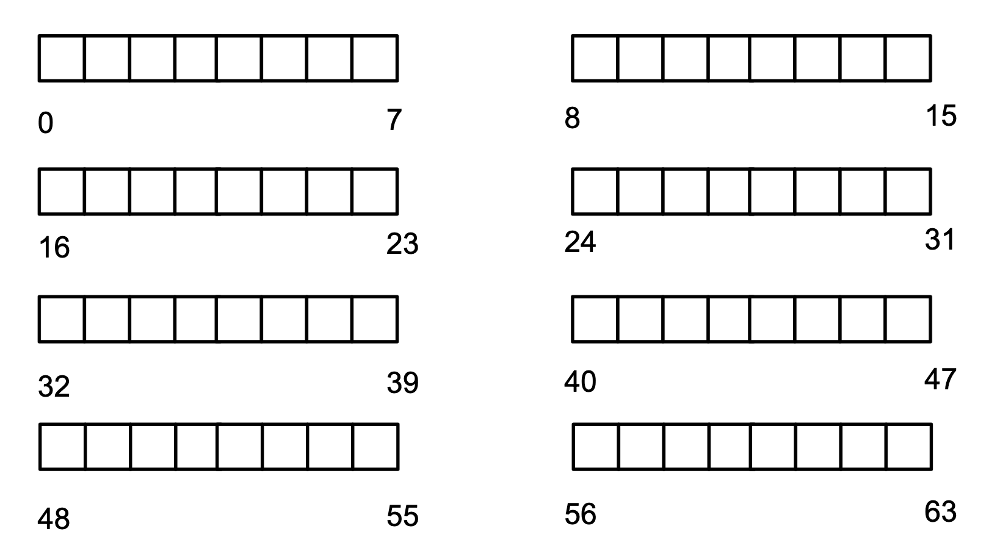

- Empty Disk: divided into blocks, e.g., 4KB per block

#### ON-DISK STRUCTURE: DATA BLOCKS

  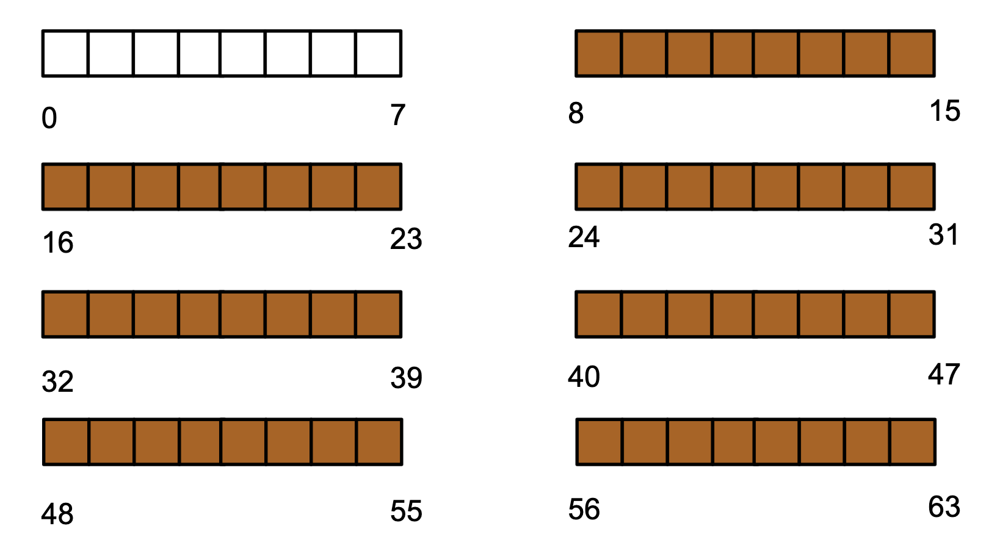

- **Data blocks**: reserve a fixed portion of disk

#### ON-DISK STRUCTURE: INODE TABLE

  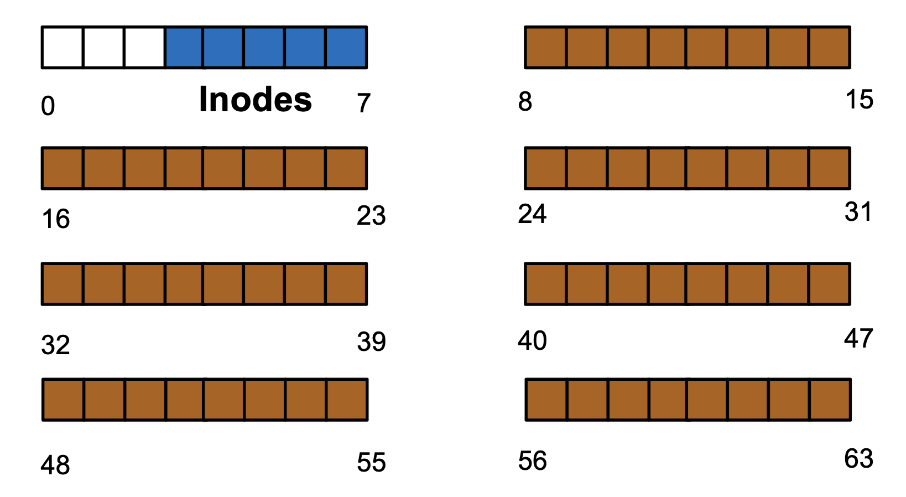

  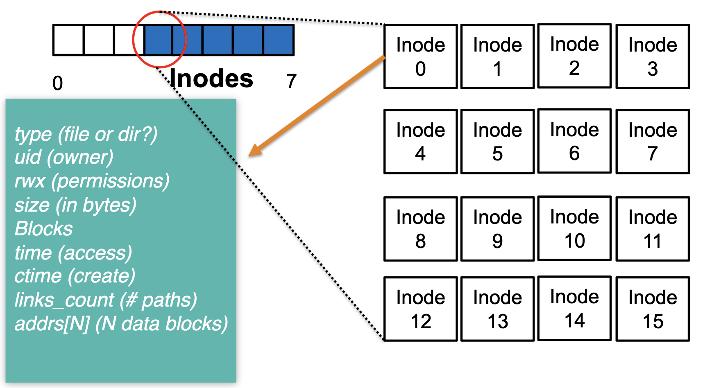

- **Inode table**: store inodes, each inode 256 bytes, a block can store 16 inodes

  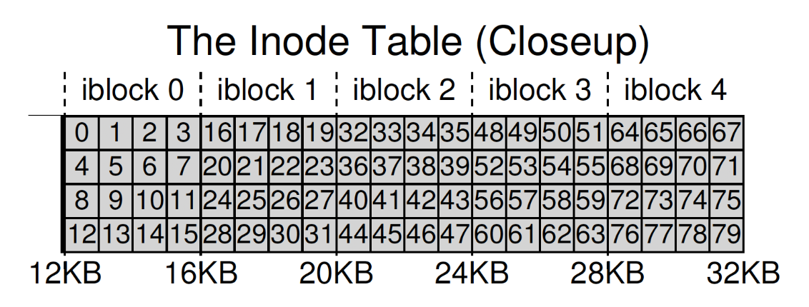

- Block: 4KB
- Inode: 256 bytes
- Sector: 512 bytes
- If accessing **inode 32**
    - Which block -> $\frac{32 * 256}{4 KB} = 2$ (inode block)
    - Which sector -> $\frac{(2 * 4KB) + 12 KB}{512B} = 40$ (sector)

> block -> $\frac{\text{inodeNumber * sizeof(inodeTable)}}{\text{blockSize}}$

> sector -> $\frac{(\text{block * blockSize}) + \text{inodeTableStartAddr}}{\text{sectorSize}}$

  

- Pointers to indicate the block numbers

  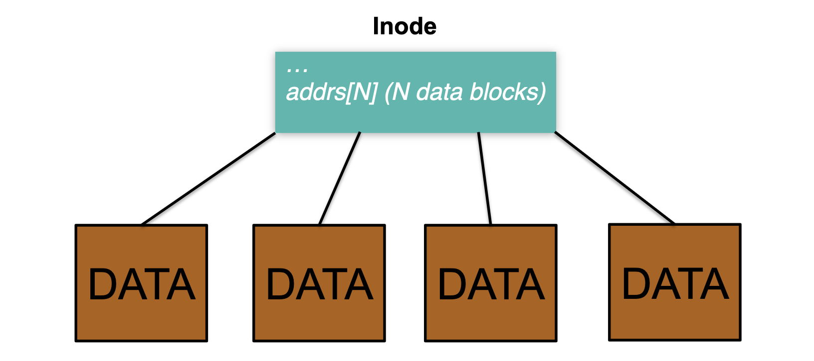

- **Direct pointers**: refer to a data block
- **Issue**: limited size
    - Assume 256-byte inode, all can be used for pointers, 4-byte addrs
    - The largest file is 4KB * 64 = 256KB

  

- **Indirect pointers**: refer to a block containing more pointers
- **Issue**: overhead, two disk reads for each access

  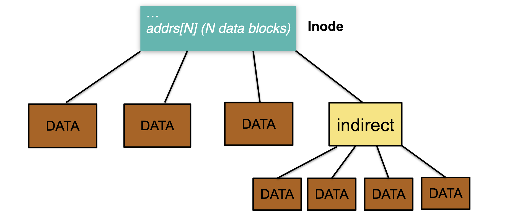

- **Hybrid pointers**: some direct pointers + indirect pointer
- Better for small files -> Most files are small
- Multi-level index: larger file
    - Triple indirect pointer: (12 + 1024 + 1024^2) * 4 KB ≈ 4 GB

  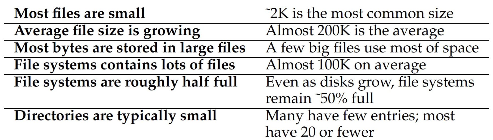

- Other approacehs
    - **Extent-based**: ext3, ext4 Linux
    - **Linked lists**: file-allocation tables (FAT) Windows

#### ON-DISK STRUCTURE: DIRECTORIES
- **Directories** are treated as a special type of file
- Common directory design: just store directory entries in files
    - Different file systems vary
    - Store directory entries in data blocks
    - Use bit in inode to distinguish directories from files
- Various data structures (formats) could be used
    - Lists (VSFS)
    - B-trees

  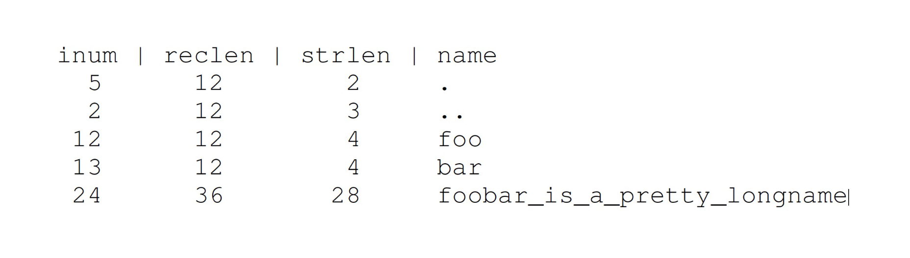

- reclen: the total bytes for the name & any left over space
- strlen: the actual length of the name
- A directory with inode 5, 3 files

#### ON-DISK STRUCTURE: BITMAPS

  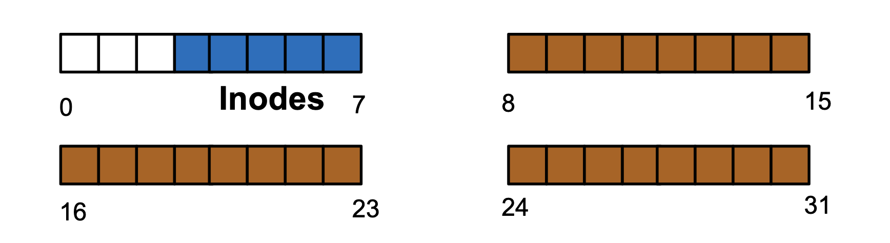

- How does file system fins free data blocks or free inodes? 
    - **Free list**: points to the first free block
    - **Bitmaps**: each bit to indicate the availability

- Tradeoffs: 
    - **Free list**: Cannot get contiguous space easily
    - **Bitmap**: Easy to allocate contiguous space for files

  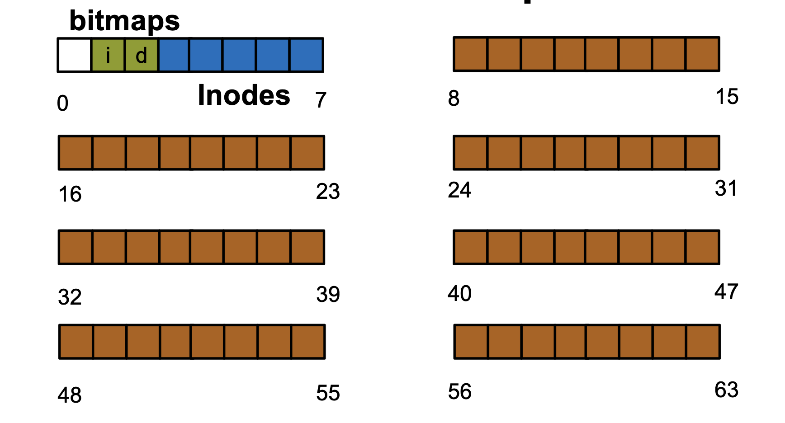

- One bitmap for inodes
- One bitmap for data blocks

#### ON-DISK STRUCTURE: SUPERBLOCK

- Need to know basic file system configuration and runtime status, such as: 
    - Block size
    - How many inodes are there
    - How much free space
- Store all these metadata info in a superblock

  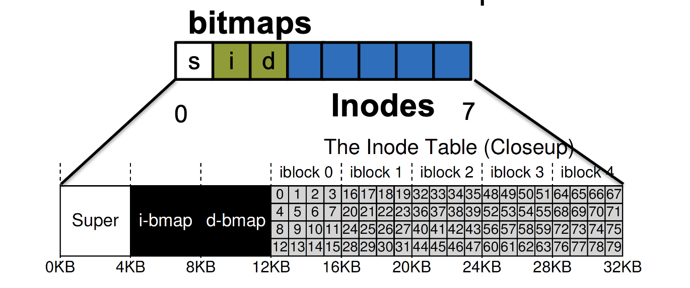

#### FILE SYSTEM OPERATION

- open("/foo/bar", O_RDONLY)

  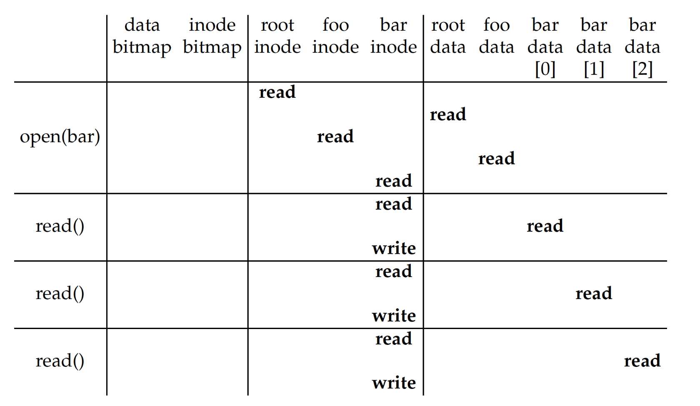

- create(/foo/bar)

  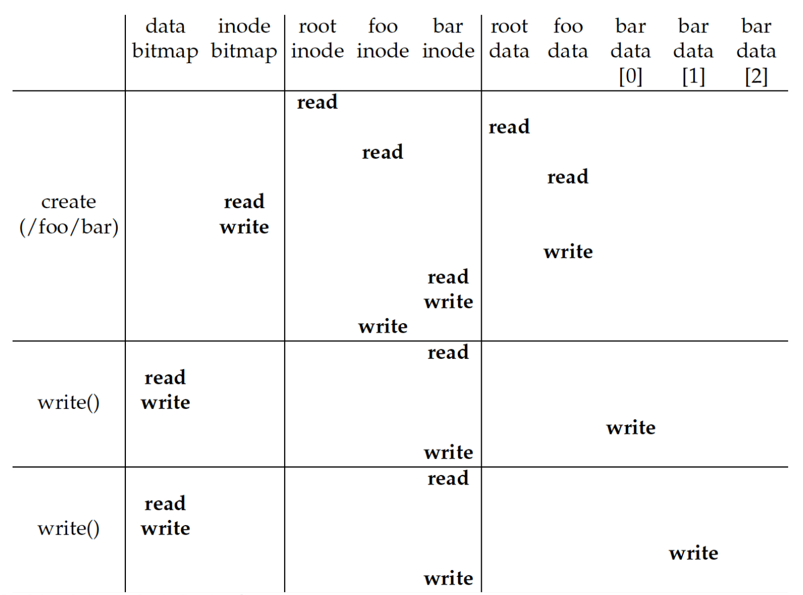

- write to(/foo/bar)

  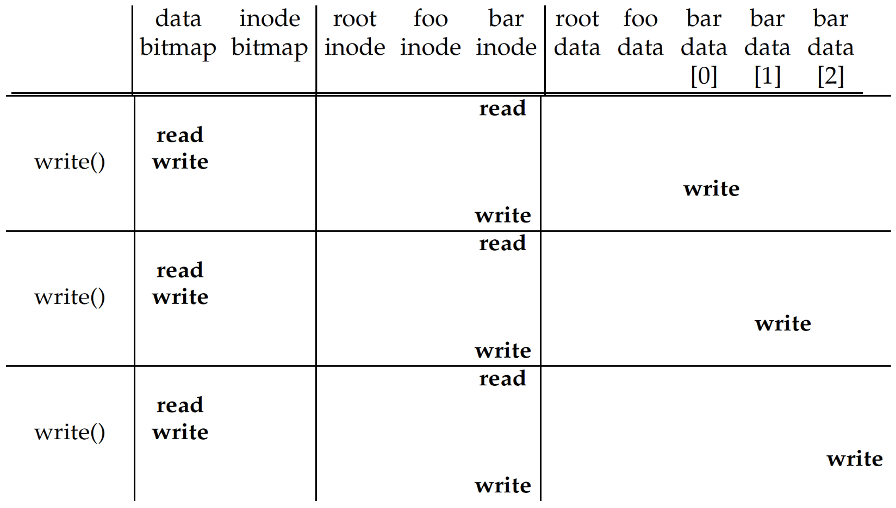

- close(/foo/bar)

  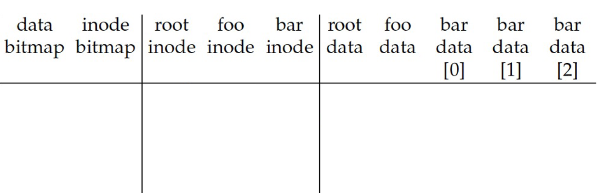

#### IMPROVING PERFORMANCE

- I/O operations are expensive
- How can the system avoid excessive I/O operation?
- Cache:
    - Read: Using DRAM to store important blocks
    - Write: write buffering, delaying writes

  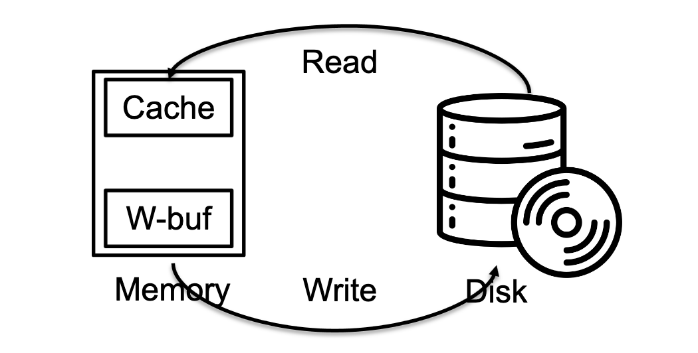

#### SUMMARY

  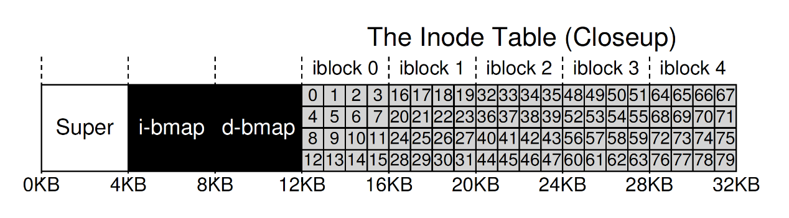

- Inodes table
- Directories: a special type of files
- Bitmaps for allocation