### MEMORY

#### OUTLINE
- Memory
- Address space of a process
- Virtual address and virtual memory
- Basic methods to translate virtual address to physical address

#### MEMORY
> Recall: Program must be brought from disk into **memory** and becomes a prosess

<p align="center">
  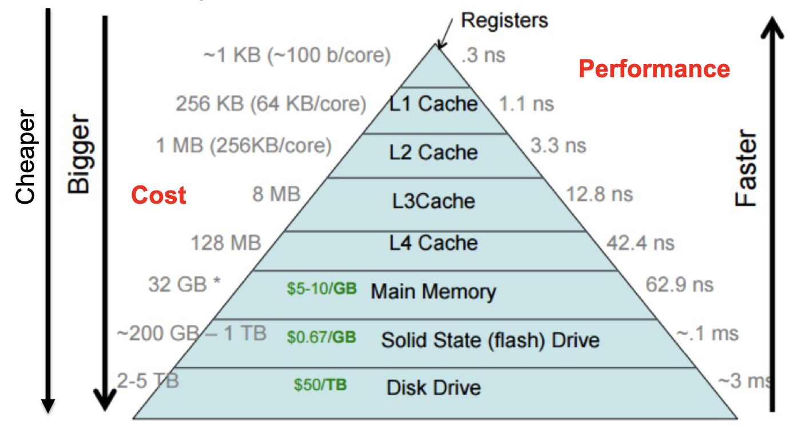
</p>

#### ADDRESS SPACE
- Why do we need an abstraction for memory?
    - Early computers did not have memory abstraction
    - Programs directly access physical memory
- Uniprogramming: Only one process runs at a time

<p align="center">
  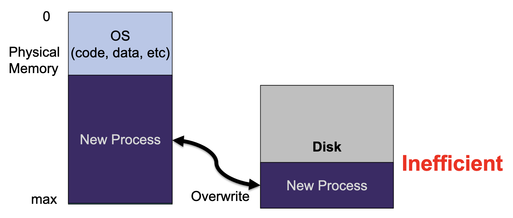
</p>

- Multiprogramming (now): Processes share hardware resources, CPU, memory
- Instead of having only one process, multiple processes reside in the memory
- Processes may interfere with eachother and suffer from access issues if no memory abstraction (protection)
<p align="center">
  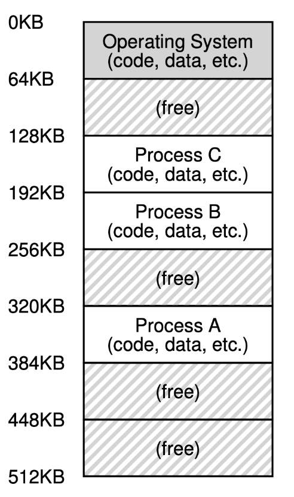
</p>


- One process can overwrite another process. 
- It works with **Program Status Word** (PSW), but has relocation issues. 

- **Address space**:
    - An easy-to-use abstraction of physical memory
    - The set of addresses that a pricess can use to address memory
    - The running program's view of memory in the system
    - Consists of static and dynamic components:
        - **Static**: code and some global variables
        - **Dynamic**: stack and heap
    - 3 components (more than 3, but enough to get the idea)
        - Code: will not be changed during execution, so it is static
        - Heap:
            - Explicity dynamicially-allocated, user-managed memory, such as ```malloc()``` in C or ```new``` in C++ and Java
            - Should be deallocated explicitly by programmers, ```free()```.
        - Stack:
            - Local variables, pass parameters, return values
            - LIFO
            - Simple and efficient implementation: stack pointer
                - Add/Push: increment pointer
                - Free/Pop: Decrement pointer 
    - OS virtualizes memory by using virtual addresses
    - Address translation/mapping: virtual to physical
    - Goals of virtual memory
        - Transparency: Processes are unaware that memory is shared
        - Protection: Cannot read data or corrupt OS of other processes
        - Efficiency: Time and space
    - Any address that programmer can see is a virtual address
<p align="center">
  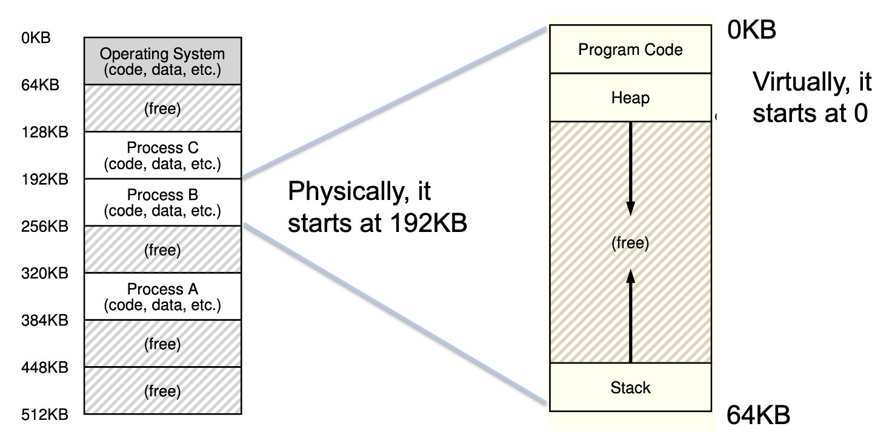
</p>

#### ADDRESS TRANSLATION

- Compiler/linker assumes that the process starts at 0 
- When the OS loads the process, it allocates a contiguous segment of memory where the process fits
- How to relocate the addresses in a transparent way?
    - Address translation methods: 
        - Static relocation (no HW req.)_
            - At load time, the OS adjusts the addresses in a process to reflect its position in memory
            - Once a process is assigned a place in memory and starts executing it, the OS cannot move it
            - *Issue*: inflexibility, rewrite
        - Dynamic relocation (HW supported): 
            - Two registers for each process
                - Base register indicates the starting address
                - Bound/limit register determines the memory size
            - Memory-Management Unit (MMU)
                - Translate virtual addresses to physical addresses
                - Such translation happens for every memory refence

#### DYNAMIC RELOACTION

<p align="center">
  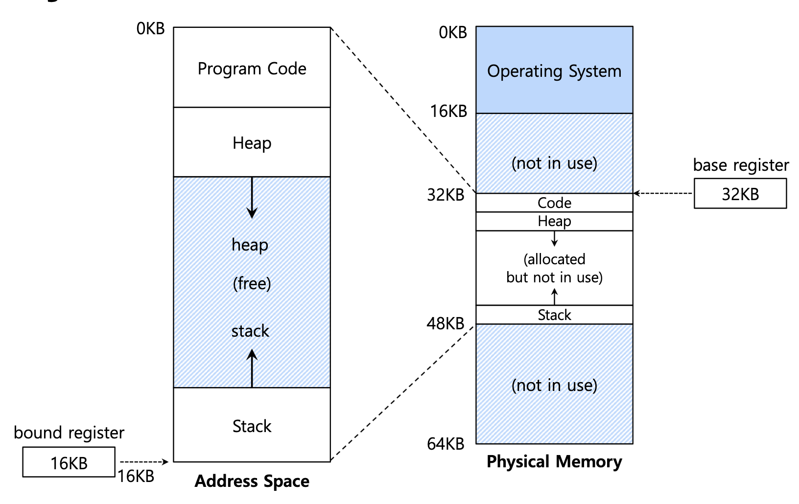
</p>

- Every memory reference has the following procedure
    - When a program starts running, the OS decides where in the physical memory a process should be loaded. Set the base register
    - Each memory reference is translated as follows

        $\text{physical address} = \text{virtual address + base}$

    - Check wather the address is within the bound

<p align="center">
  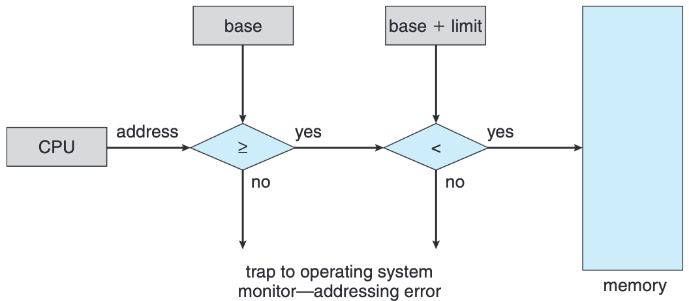
</p>

- Assume a process withits base register of 32KB and its size of 16KB
- Fetch instruction ```ldr``` at virtual address 128

    ```128 : ldr w8, [sp, #12]```
- The physical address of instruction ```lrd``` is

    $32896 = 128 + 32KB \text{base}$
- The larges address this process can access is

    $48KB = 16KB + 32KB \text{base}$
- What is the problem of dynamic relocation?
    - Fragmentation
    - Internal or external


#### MEMORY ALLOCATION
- Allocation contiguous memory spaces to different processes:
    - Fixed partition
        - Physical memory is broken up into fixed partitions
        - Only one base register is needed for each process
        - Advantage: easy to implement and fast context switch
        - Problem: internal fragmentation
    - Variable partition
        - Base register and limit register (dynamic relocation)
        - Advantage: flexible
        - Problem: external fragmentation

#### INTERNAL FRAGMENTATION
- Each partition has the same size

<p align="center">
  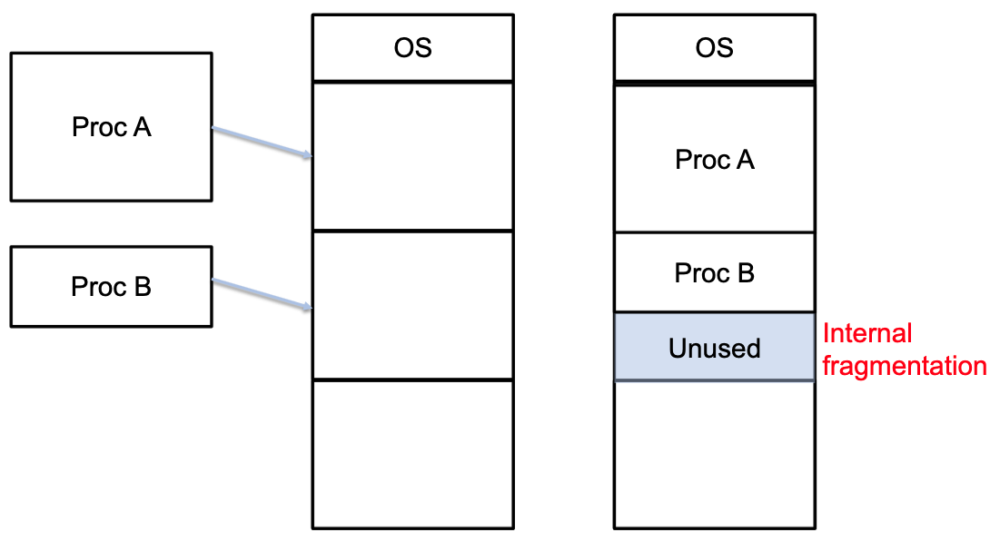
</p>

#### VARIABLE PARTITION
- Each process is assignes a memory partition as it needs
- OS maintains a table of available memory space, also called hole: holes of various size are scattered throughout memory
- Allocation algorithms:
    - First-fit: allocate the first hole that is big enough
    - Best-fit: allocate the smallest hole that is big enough
    - Worst-fit: allocate the largest hole
<p align="center">
  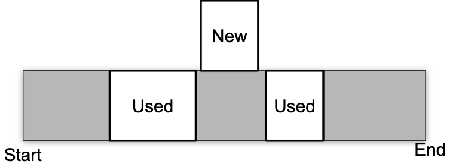
</p>

- As processes are loaded to memory and removed from memory, the memory freed are fragmented into small holes
<p align="center">
  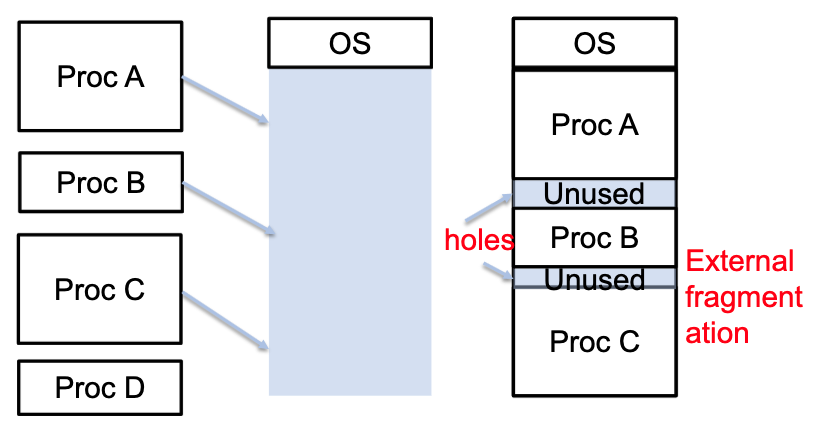
</p>


#### EXTERNAL FRAGMENTATION
- Sufficient memory to complete a request, but not contiguous
- Compaction is a solution to external fragmentation
    - Shuffle the memory contents to place all free memory together in one large block
- Concerns: performance overhead
    - Memory intensive
<p align="center">
  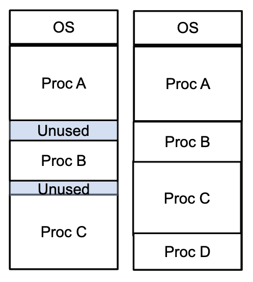
</p> 


#### SEGMENTATION
- Instead of having only one pair of registers, divide the contiguous address space into several logic segments
<p align="center">
  
</p>

| ```Job``` | ```Base``` | ```Size``` |
|-----------|------------|------------|
| ```Code```| ```32K``` | ```2K``` |
| ```Heap```| ```34K``` | ```2K``` |
| ```Stack```| ```28K``` | ```2K``` |

- To reference virtual address 100
    - What is the physical address?
    - 32K + 100 = 32 868

- To reference virtual address 5000
    - What is the physical address?
    - 5000 - 4096 = 904
    - 904 + 34K = 35 720

- If an illegal address such as 7KB which is beyond the end of heap is referenced, the OS occurs segmentation fault. 
    - The hardware detects that address is out of bounds.
<p align="center">
  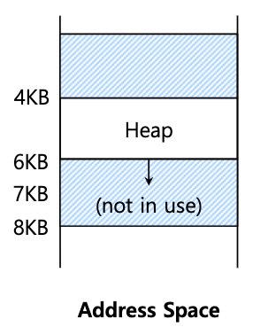
</p>

- Explicit approach
    - Break the addres space into segments based on the top few bits of virtual address
<p align="center">
  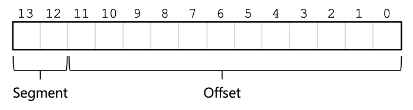
</p>

- Example: virtual address 4200 (01000001101000)
<p align="center">
  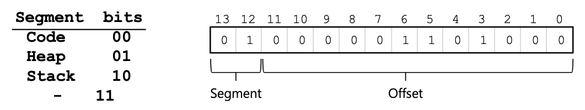
</p>

- Stack grows backward
- Extra hardware support is needed
    - The hardware checks which way the segment grows
    - 1: positive direction, 0: negative direction
<p align="center">
  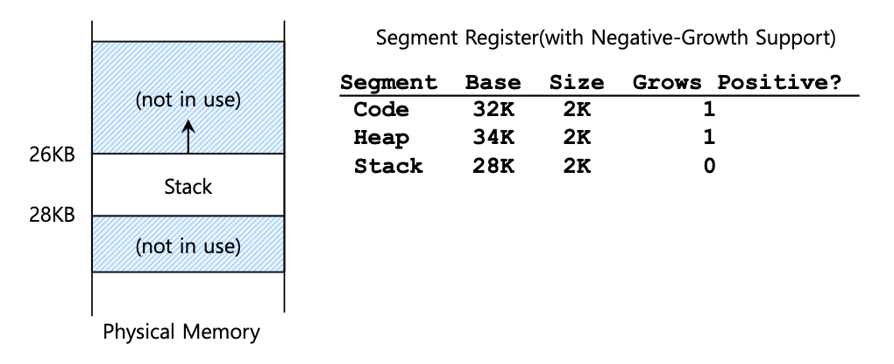
</p>

- Segment can be shared between address space
    - Code sharing is still in use in systems today
    - Need extra hardware support
- Hardware support: protection bits.
    - A few more bits per segment to indicate permissions of read, write and execute
<p align="center">
  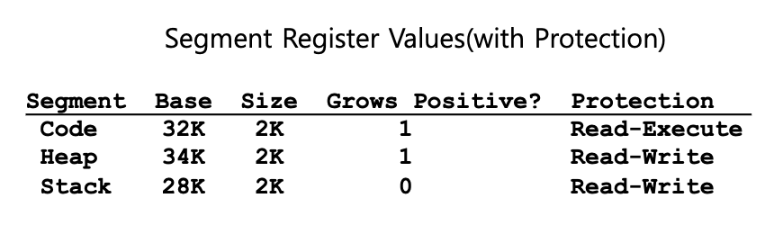
</p>

#### SUMMARY
- Address space is an easy-tp-use abstraction of physical memory
- Two types of memory address: virtual memory and physical memory
- For every memory reference, virtual memory is translated into physical memory by means of MMU
- Two types of fragmentation: internal and external
- Segmentation is helpful in reducing the wasted memory
- Segmentation suffers from external fragmentation