F### PAGING 

#### OUTLINES 
- Paging
- Page Translation
- Page Table
- Table Lookaside Buffer (TLB)
- Multi-level paging
- Page Swapping
- Page Replacement

#### PAGING
- Segmentation allows non-contiguous memory assignments
- Segmentation gets memory fragmented (external fragment)
    - Performance overhead (compaction)
- Paging is another method that allows the physical address space of a process to be non-contiguous
- Divide physical memory into fixed-size blocks, called page frames (or simply frame)
- Divide virtual memory into blocks of the same size called pages 
- Flexible mapping pages to frames
- Keep a track of all free frames
- Set up a page table to translate
- Need both OS and Hardware
- No external fragment, but internal fragment
- A 64-byte process is mapped to physical memory
- The page size is 16 bytes

  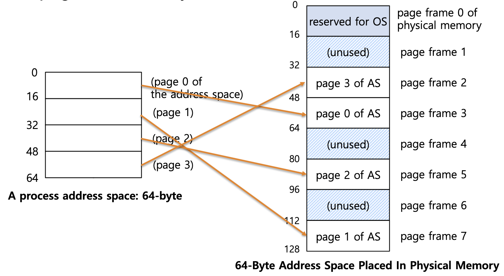

- Flexibility: Supporting the abstraction of address space effectively
    - Don't need assumption how heap and stack grow and are used
- Simplicity: Ease of free-space management
    - The page in address space and the page frame are the same size
    - Easy to allocate and keep a free list

#### PAGE TRANSLATION

- A virtual address is split into two parts
    - Virtual page number: used as an index into a page table which contains base address of each page in physical memory
        - High bits to indicate page number
    - Offset: combined with base address to define the physical memory address that is sent to  the memory unit
        - Low bits to indicate offset
- Given virtual address space $2^{m}$ and page size $2^{n}$, **n** bits for offset and **m-n** bits for page number
- Only need to translate the page number to determine where the physical page is
- Offset remains the same
- 32-bit virtual address
- Page size 4KB
- Physical memory 2GB

> How many bits does the offset need? 
> $Log(2^{12})$ for the offset - 12 bits

> And bits for page#? 
> $\frac{2GB}{4KB} = 2^{31-12} = 2^{19}$
> $Log(2^{19})$ for the page number - 19 bits

- Page table:
    - To keep track of the mapping of virtual to physical addresses
    - A per-process data structure

  

- The page table data structure is kept in main memory
- Page-table base register indicates the starting address of page table
- The simplest form of a page table is a linear page table, an array
- Page Table Entry (PTE) includes
    - Translation information
    - Other information

  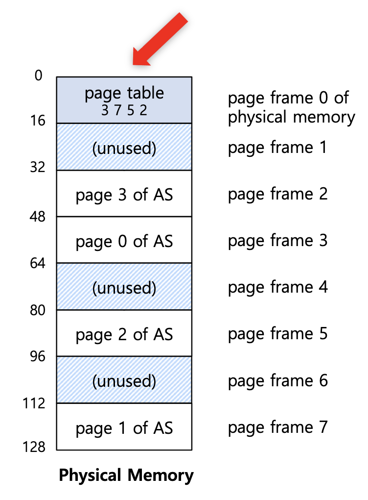

- XV6 - 64 bits, each PTE consists of  
    - 44 bits (10 - 53) for physical page number
    - 10 bits (0 - 9 ) for flags, other information

  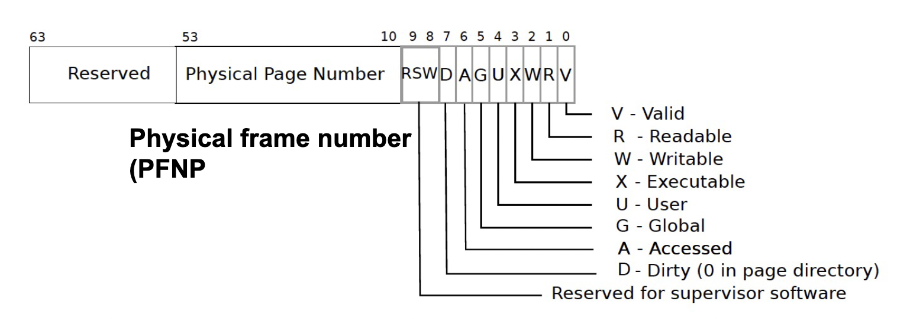

#### ADDRESS TRANSLATION

- XV6-SV39:
    - 39-bit virtual address
    - 27 bits to index PTE
    - 12 bits to determine the address within a page frame
    - 39 bits -> 512GB sufficient for RISC-V
- XV6-SV48
    - 48-bit virtual address

  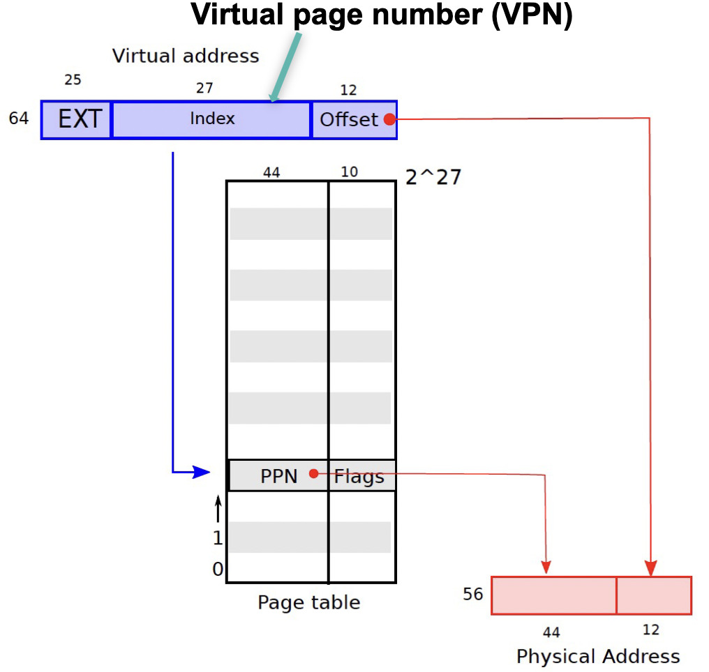

INVERTED PAGE TABLES
- Keeping a sigle page table that has an entry for each physical page frame of the system
- The entry tells us which process is using this page, and which virtual page of that process maps to this physical page
- Pros: Memory saving
- Cons: Long searching time, page sharing

PAGE SHARING

  

- For per-process page table, let two pages point to the same frame
- For inverted page table, it is difficoult to implement page sharing

ADDRESS TRANSLATION
- The steps of each memory reference
    1. Extract virtual page number from virtual address (memory access)
    2. Calculate address of page table entry
    3. Fetch page table address
    4. Extract physical page frame number
    5. Determine physical address
    6. Fetch physical address to register (memory address)

#### PROBLEMS OF PAGING
- The issue of the introducesd paging mechanism
    - Page table in main memory
    - Fetch the translation from in-memory page table
    - Explicit load/store access on a memory address
- In this scheme every data/instructuon access requires two memory accesses
    - One for the page table
    - and one for the data/instruction
- The performance is affected by a factor of 2!

#### MEMORY ACCESSES OF PAGING

  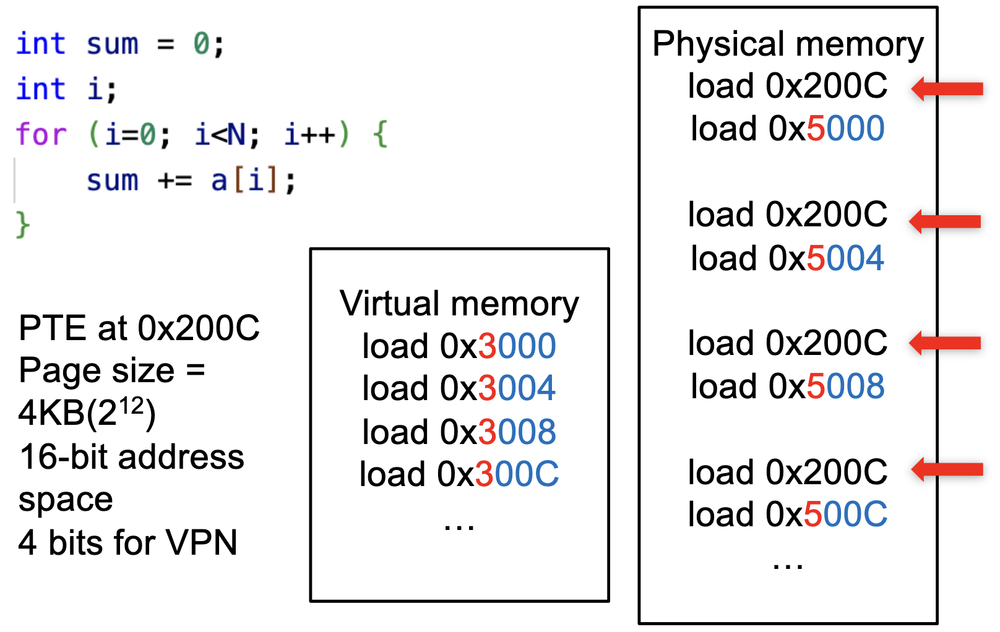

#### TABLE LOOKASIDE BUFFER (TLB)
- To speed up the paging translation, hardware helps and builds a cache to store some populat translations
- Translation lookaside buffer (TLB)
    - Part of Memory-management unit (MMU)
    - Hardware cache
- Memory reference with TLB
    - TLB hit: Vitual page number (VPN) is in TLB and can be quickly accessed
    - TLF miss: VPN is not in TLB. Access page table to get the translation, update the TLB entry with the translation

  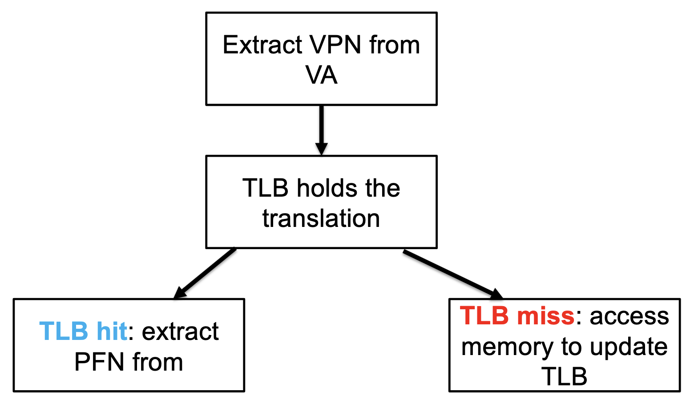

  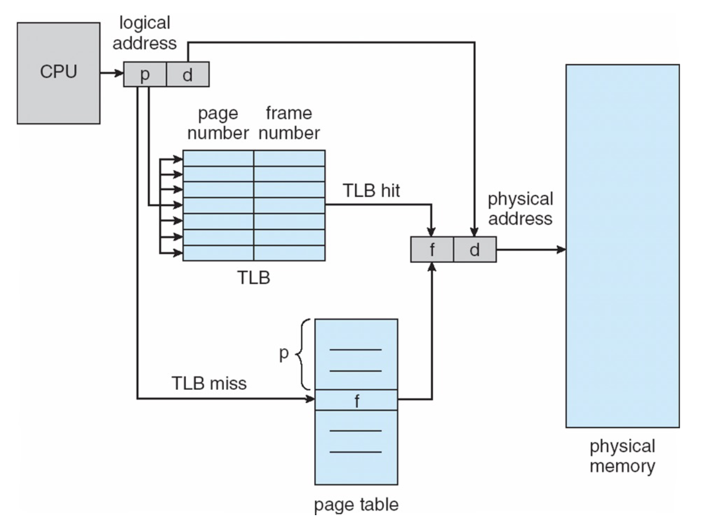

- Temporal Locality
    - An instruction or data item that has been recently accessed will likely be re-accessed soon in the future
    > 1^{st} access is page 1. 2^{nd} access is also page 1.
- Spatial Locality
    - If a program accesses memory at address *X*, it will likely soon memory near *X*
    > 1^{st} access is page 1. 2^{nd} access is near page 1.

- TLB is a fully associative cache
    - Any given translation can be anywhere in the TLB
    - Hardware searches entire TLB in parallel to find the target
- A typical TLB entry
    VPN|PFN|other bits
    - Valid bit
    - Protection bit
    - Dirty bit

#### TLB ISSUE: CONTEXT SWITCH
- TLB contains translations only valid for current running process
- Switching from one process to another requires OS or hardware to do more work
- How to distinguish which process a TLB entry belongs to
    - Process 1: VPN 10 -> PFN 100
    - Process 2: VPN 10 -> PFN 170

  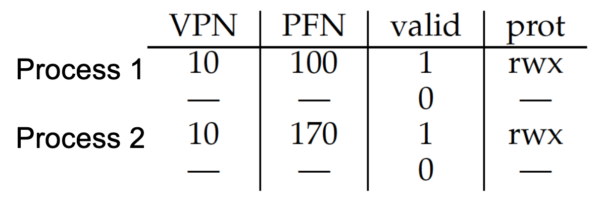

- Solution 1: Flush
    - OS flushes the whole TLB on context switch
    - Flush operation sets all valid bit to 0
    - Problem: the overhead is too high if OS switches processes too frequently
- Solution 2: Address space identifier (ASID)
    - Some hardware systems provide an anddress space identifier (ASID) files in the TLB
    - Think of ASID as a process identifier

  

#### PROBLEMS OF PAGING
- Page table is too big
- A linear page table array for 32-bit address space  ($2^{32}$ bytes) and 4KB page ($2^{12}$ bytes)
  - How many pages: $2^{20}$
  - How much memory: 4MB assuming each page-table entry is of 4 bytes
    - $2^{32-log(4KB)} * 4 = 4MB$
  - One page table for one process:
    - 100 processes: 400MB

#### SMALLER PAGE TABLE
- Naïve solution:  
  - Bigger page size -> smaller page table
  - 32-bit address space: 4KB page size -> 16KB
  - We can reduce the size by 4x to 1MB per page table
- Page size: $2^{x}$, 4KB - 1GB
  - getconf PAGESIZE (MacOS and Linux)
  - 16KB for MacOS
- Problem: Internal fragment
  - Do not use up the whole page

#### VARIABLE PAGE SIZE
- TLB has limited size
  - 16-512
  - Multiple-level implementation, like cache
- Smaller page size -> more TLB entries
  - A process of 64KB, 4KB page size
    - 16 TLB entries
  - 1MB page size
    - 1 TLB entries
- Variable page size: 
  - This depends on hardware and OS
  - Windows 10 supports 4KB and 2KB
  - Linux has default page size (4KB) and huge page

#### PAGING + SEGMENTATION
- Hybrid Approach: Paging and Segments
- Recall: Segmentation
  - Different registers for each segment
- Instead of one single page table for one process, one table for each logical segment

  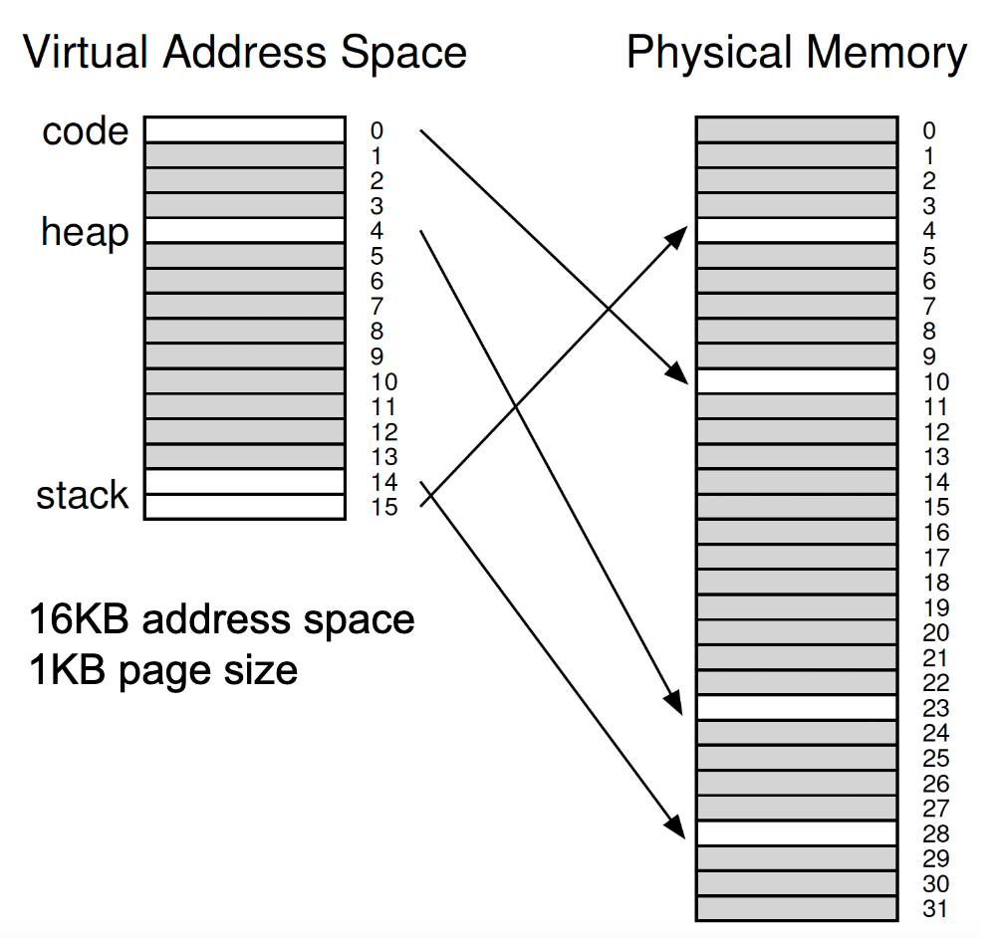

- Base register to the point to the physical address og the page table.
- Limit register to determine the size of the segment, i.e., how many valid pages the segment has. 
- 32-bit virtual address space with 4KB pages
  - 12-bit for offset
- 3 segments: code, heap, stack

  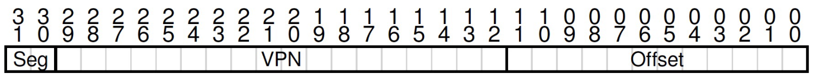

- Problems: page table waste for sparsely-used heap
- Problems: external fragmentation

#### MULTI-LEVEL PAGING

- Large page table is contiguous and may have some unused pages.
- Allocate page table in a non-contiguous manner.
- Break the page table into pages, i.e., page the page tables.
- Create **multiple levels of page tables;** outer level **page directory**
  - Page directory to track whether a page of the page table is valid. 
- If an entry page of page table entries is invalid, no allocation.

  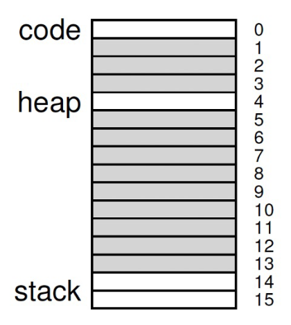

- A virtual address of 32-bit with 4KB page size is divided into
  - a page number consisting of 20 bits
  - a page offset consisting of 12 bits
- A page table  entry is 4 bytes
- Since the page table is paged, the page number is further divided into 

  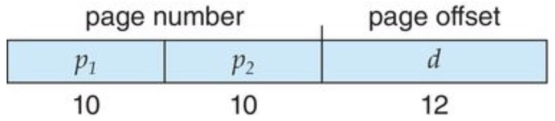

- where $p_{1}$ is an index into the page directory, and $p_{2}$ is the page table index

- 16KB address space, 14 bit address
- 64-byte ($2^{6}$) page size
- Page table entry 4 bytes
- Problem with 2 levels: page directory may not fit in a page
- Split page directories into pieces
- Multi-level page directories and each one can fit in a page
- 30-bit address space, 512-byte page size, 4 byte PTE

  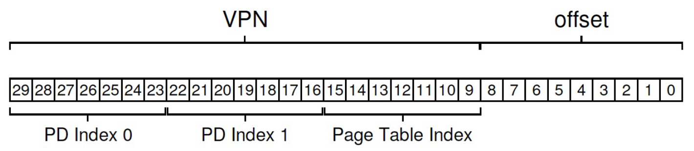

#### PAGE SWAPPING
- Motivation:
  - Processes spend majority of time in small portion og code
    - The 90/10 rule: approximately 90% of time in 10% of code
  - Process only uses small amount of address space (pages) at any moment
  - Only small amount of address space (pages) need to be resident in physical memory
- Hardware: 
  - Memory: fast, but small, 2-100 GB/s
  - Disk: slow, but large, 80-160 MB/s (HDD) 500MB/s (SSD)
- Idea: 
  - Process can run with only some of its pages in memory
  - Only keep the actively used in pages in memory
  - Keep unreferenced pages on disk
- Swapping makes it possible for the total physical address space of all processes to exceed the real physical memory of the system

  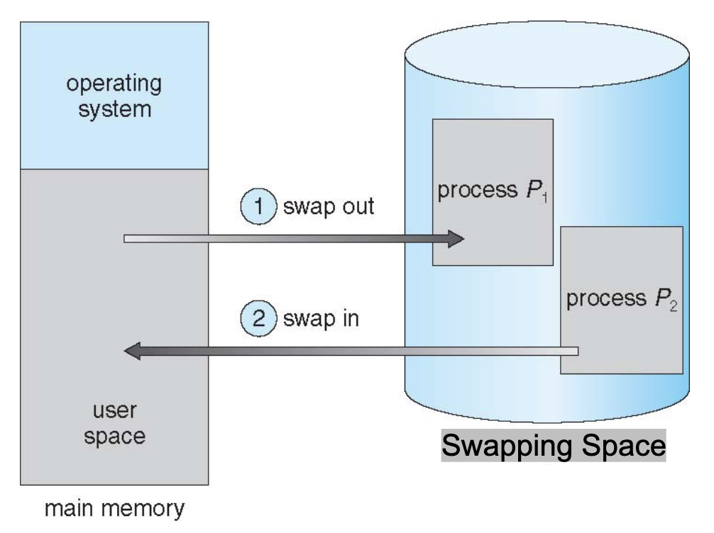

- Reserve some space on the disk for moving pages back and forth - Swap space
- OS keeps track of the swap space, in page-sized unit.

  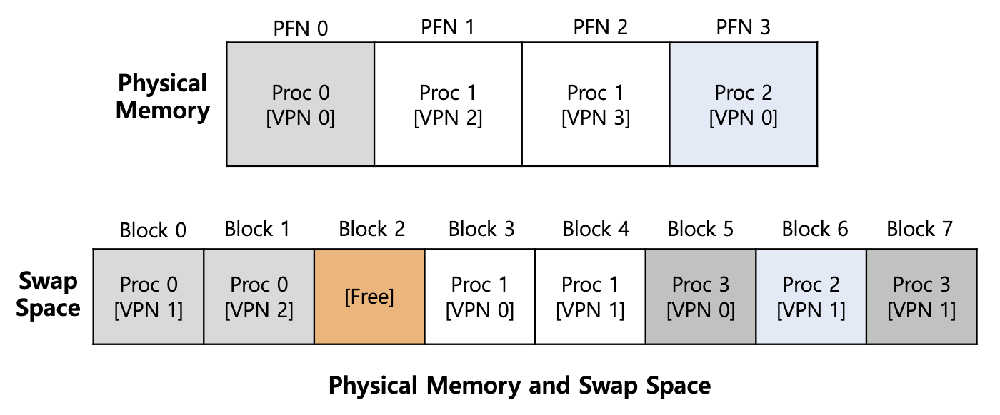

> How to know where a page lives?
> - Present bit/Valid bit
> - 1 indicates in-memory
> - 0 indicated in-disk

  

  

#### PAGE SWAPPING POLITICS
- The objective of page swapping policies: to minimize the number of page faults (cache misses)
- Two decisions:
  - Page selection: *When* should a page on disk be brought into memory?
  - Page replacement: *Which* in-memory page should be evicted to disk?

#### PAGE SELECTION 
- Demand paging:
  - Load page only when it is needed (demand)
  - Less I/O, less memory
  - Problem: High page fault cost
- Prefetch:
  - Load page before referenced
  - OS predicts future accessed pages (oracle) and brings them into memory early
  - Works well for some access patterns, like sequential pages

#### COPY-ON-WRITE PAGING
- Copy the page only if a process writes to it (demand)
  - Process creation **fork() + exec()**

  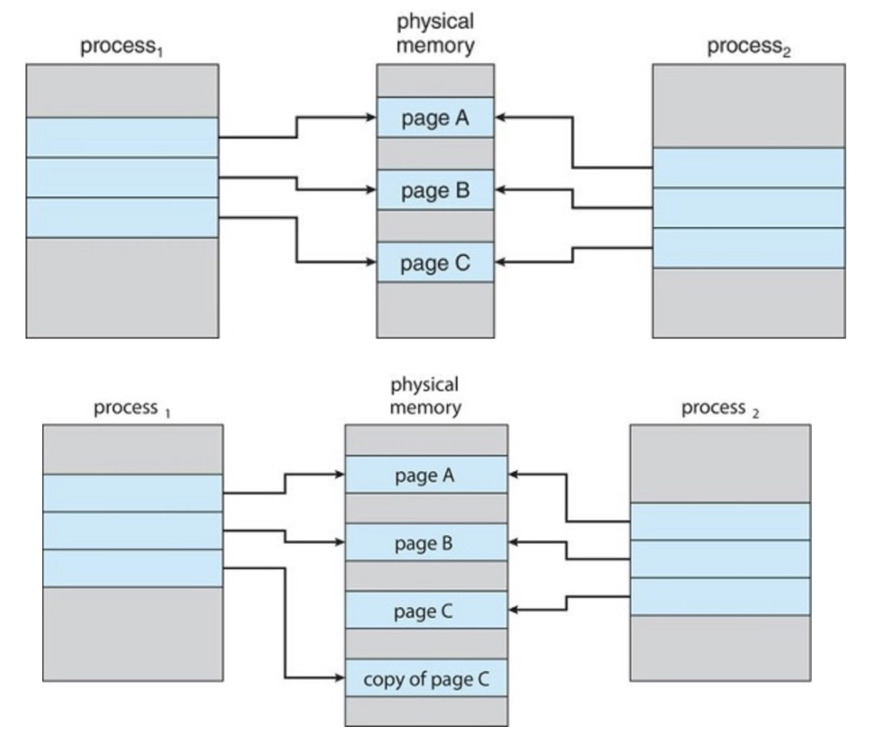

#### PAGE REPLACEMENT 
- When does page replacement happen?
- Lazy approach
  - If entire memory is full, OS then replaces a page to make room for some other page. 
  - This is unrealisitic
  - The OS usually needs to reserve some room for the new pages
- Swap Daemon, Page Daemon
  - There are fewer than LW (low watermark) pages available, a background thread that is responsible for freeing memory is activated-
  - The thread evicts pages until there are HW (high watermark) pages available

#### PAGE REPLACEMENT POLICIES
- Average memory access time (AMAT)
  - $AMAT = P_{Hit} * T_{M} + P_{Miss} * T_{D}$
  - $P_{Hit} + P_{Miss} = 1$
- Example
  - $T_{M} = 100 ns, T_{D} = 10 ms$

  

  - $AMAT = 0.9 * 100 + 0.1 * 10,000,000 = 90 ns + 1,000,000 = 1,000,090 ns$
  - What if the hit rate is 99.9%?
  - AMAT = 10.1 ms
  - Around 100x faster
- Optimal replacement:
  - Replace the page which is not used for longest time in future
  - Pros: minimal number of page faults
  - Cons: impractical, need to predict the future
  - Can be used as a comparison baseline
- FIFO: 
  - Replace the page which is loaded into memory first
  - Pros: Fair, easy to implement
  - Cons: May evict useful pages
- Least-recently-used (LRU): (Predict using history)
  - Replace the page which has not been used for longest time
  - Pros: Approximate optimal replacement
  - Cons: Difficult to implement

  

- Other policies: 
  - Random (RAND), Least-frequently used (LFU)
- The performance of replacement policies also depends on workloads
  - Random workload: LRU, RAND and FIFO no difference
  - 80-20 workload: LRU is better than RAND and FIFO
  - Looping sequential workload: RAND is better than LRU and FIFO
- What happens to performance, if adding more physical memory
  - LRU and RAND have fewer or same number of page faults
  - FIFO usually has fewer page faults, but Belady's anomaly -> more page faults
    - Sequence: ABCDABEABCDE
    - 3 frames VS 4 frames
    - 9 misses VS 10 misses
- How to implement LRU
  - Software Perfect LRU: a data structure to track reference time of all pages
  - Hardware Perfect LRU: add a timestamp register to each page
  - Practical LRU: approximate implementation, find an old page, but not necessarily the oldest one
- Clock Algorithm (Second chance) 
  - A use/reference bit for each page
    - 0 not used
    - 1 used
  - A circular queue of all physical pages
  - A clock hand to select which page to evict
    - 0 evicted
    - 1 set to 0 and move to next

  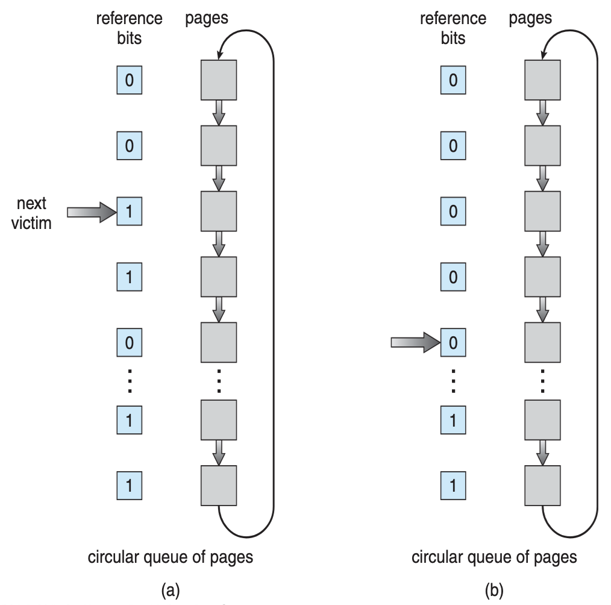

  
#### SUMMARY
- Paging: flexible virtual memory management
- Challenges with paging
  - Slow access
  - Big page table and high memory consumption
- Table Lookaside Buffer (TLB) for slow access
- Multi-level paging and inverted page tables for big page table
- Larger address space: swapping and replacement
