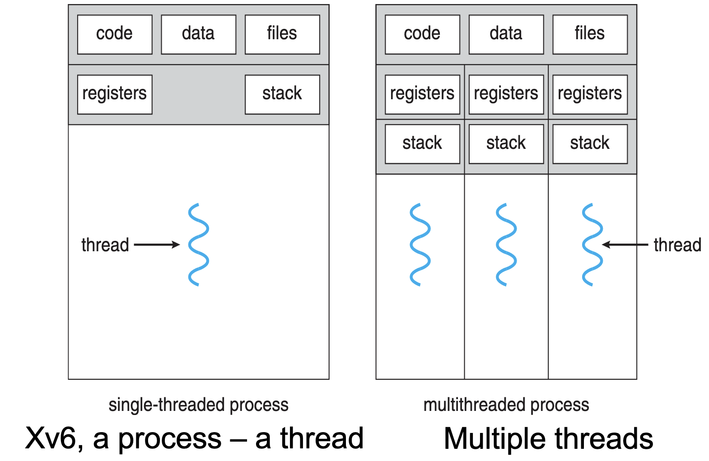
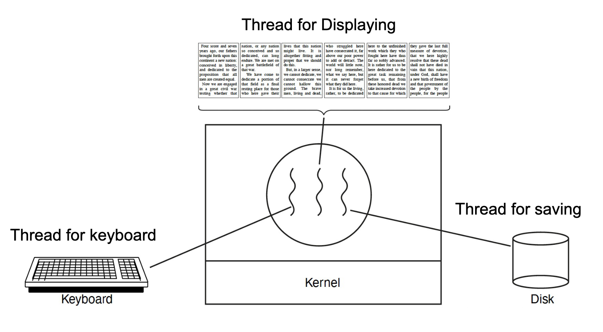
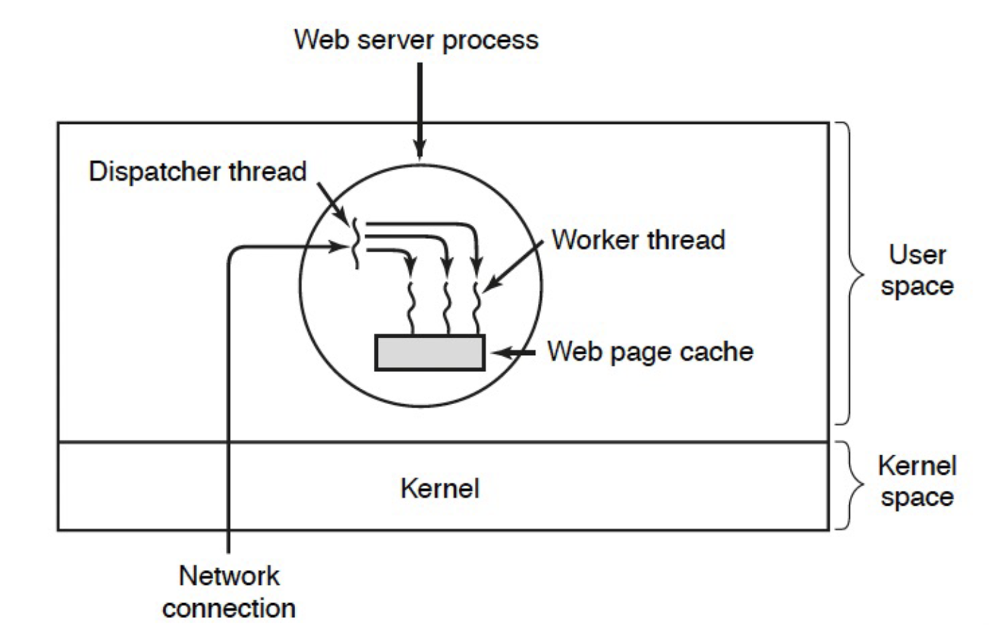
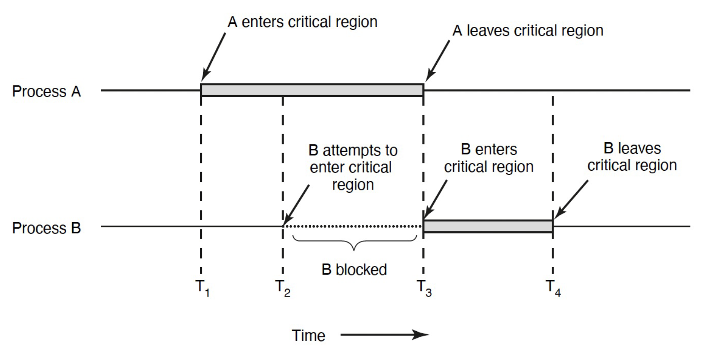

### CONCURRENCY

#### OUTLINES
- Motivation
- Thread
- Concurrency

#### MOTIVATION
- CPU: Low frequency, but multiple/many cores
- Goal: Write applications that fulle utilize may cores
- Abstraction: Process
- Build applications using communicating process
- Example: Chrome (process pr tab)
- Pros: No need for new abstractions; isolation
- Cons:
    - Cumbersome programming
    - High communication overheads
    - Expensive context switching (why expensive?)
- Inter-process communication
<p align="center">
  
</p>


#### THREAD 
- New abstraction: Thread
- Threads are just like processes, but threads of same process  **share the same address space**.
- Break large task into several cooperative threads
- Communicate through shared address space
- Allow multiple threads of the same process to be independent of each other
    - Each thread may execute different code at the same time
- Multiple threads within a process will share
    - Process ID
    - The address space: code, most data (heap)
    - Open files (file descriptors)
    - Current working directory
    - Other resources
- Each thread has its own
    - Thread ID (TID)
    - Set of registers, including Program counter and stack pointer
    - Stack for local variables and return addresses
- Advantages
    - Efficient and fast resource sharing
    - Efficient utilization of many CPU cores wih only one processor
    - Less context switching overheads
<p align="center">
  
</p>
<p align="center">
  
</p>
<p align="center">
  
</p>

- POSIX thread -> Pthread
- *A Portable Operating System Interface (POSIX) library (IEEE 1003.1c), written in C language*
- Pthread library: 60+ functions
- API specifies behavior of the thread library
- Common in UNIX (e.g., Linux) OSs
<p align="center">
  
</p>
 


> Why do we need to lock a process? When implementing the scheduling algorithm in XV6? ```p->lock```

#### LOCKING IN PROCESS SCHEDULING (XV6)

In XV6, a simple, Unix-like operating system, locking mechanisms are crucial for maintaining consistency and preventing data races when multiple processes or threads access shared resources. Specifically, `p->lock` is used within the scheduling algorithm to ensure atomic access to critical sections of code that manipulate process state.

#### PURPOSE OF `p->lock`

- **To Prevent Races:** Locking is essential to avoid race conditions, especially when allocating slots in the `proc[]` array for new processes. Without locks, two CPUs might simultaneously attempt to allocate the same slot, leading to inconsistencies.
  
- **To Ensure Consistency:** While accessing or modifying certain fields of the `struct proc`, holding `p->lock` ensures that the changes are consistent and visible across all CPUs. The fields requiring protection include:
  - `p->state`: The current status of the process (e.g., RUNNING, SLEEPING).
  - `p->chan`: Used for sleeping and waking up processes.
  - `p->killed`: Indicates if the process has been terminated.
  - `p->xstate`: The exit status of a process.
  - `p->pid`: The process identifier.

- **Exclusive Decision Making:** By using `p->lock`, XV6 ensures that only one CPU's scheduler can make decisions about moving a process to the RUNNABLE state or selecting a process to run. This exclusivity prevents multiple schedulers from making conflicting decisions about the same process.


#### CONCURRENCY

```c
#include <stdio.h>
#include <stdlib.h>
#include "common.h"
#include "common_threads.h”

volatile int counter = 0;
int loops;
void *worker(void *arg) {
    int i;
    for (i = 0; i < loops;i++)
    { counter++; }
    return NULL;
}

int main(int argc, char *argv[]){
    if (argc != 2){
        fprintf(stderr, "usage: threads <loops>\n");
        exit(1); }
    loops = atoi(argv[1]);
    pthread_t p1, p2;
    printf("Initial value : %d\n", counter);
    Pthread_create(&p1, NULL, worker, NULL);
    Pthread_create(&p2, NULL, worker, NULL);
    Pthread_join(p1, NULL);
    Pthread_join(p2, NULL);
    printf("Final value : %d\n", counter);
    return 0;
}
```
This C code demonstrates a simple multi-threaded program using POSIX threads (pthreads) to increment a shared counter variable. 
Certainly! Let's make the explanation more informative and easier to read, maintaining the structure you've provided.


#### CONCURRENCY AND CRITICAL SECTIONS 

When a shared variable, like a counter, is incremented, the operation is not atomic but consists of three distinct instructions:
1. `ldr w8, [x9]`: Load the current value of the counter.
2. `add w8, w8, #0x1`: Increment the value.
3. `str w8, [x9]`: Store the new value back into the counter.

#### ILLUSTRATION OF CONCURRENCY ISSUE 

Consider two threads accessing the same counter simultaneously:

- **Thread 1** executes the load, increment, and store instructions.
- **Thread 2** also attempts to perform these operations concurrently.

This scenario leads to a **race condition** because the outcome depends on the non-deterministic sequence of instruction execution between threads. If both threads load the same initial value before either stores the incremented value, one increment will be lost, demonstrating the need for synchronization.

#### CRITICAL SECTION 

- A critical section refers to a segment of code where a process or thread accesses a shared resource, such as a variable or data structure. The concurrency issue described above highlights the need for critical sections to be executed atomically, ensuring that only one thread or process can execute the critical section at any given time. This is achieved through locking mechanisms like `p->lock` in XV6, which serialize access to critical sections and prevent data races.

In summary, locking with `p->lock` in XV6 is a fundamental mechanism to ensure that operations on critical parts of the process structure are performed atomically, thereby maintaining system integrity and consistency in a multi-CPU environment.
- Concurrency leads to non-deterministic results
    - Different results even with same inputs
- Race condition: Multiple threads of execution update the shared data structure, and the final result depends on the execution order
- Programmers must make sure that some high-level code sections are executed atomically
    - Atomic operation: It completes in its entirey without worrying about interruption by any other potentially conflict-causing thread
- The critical-section problem
- Problem: ensure that when one thread is executing in its critical section, no other thread is allowed in that critical section
- Solution:
    - Mutual exclusion: Only one thread in critical section at a time
    - Progress (deadlock-free): If several simultaneous requests, must allow one to proceed
    - Bounded (starvation-free): Must eventually allow each waiting thread to enter

#### MUTUAL EXCLUSION
<p align="center">
  
</p>

#### SUMMARY
- More cores fabricated on a single CPU
- New abstraction: thread
    - sharing address space
- Concurrency: non-deterministic
    - mutual exclusion