### LOCK

- A lock is a variable
- Objective: Provide mutual exclusion
- Two states
    - Available or free
    - Locked or held
- lock(): tries to acquire the lock
- unlock(): releases the lock that has been acquired by caller
```c
lock_t mutex
void *worker(void *arg) {
    int i;
    for (i = 0; i < loops;i++) {
    lock(&mutex);
    counter++;
    unlock(&mutex)}
    return NULL;
}
```
- A good lock:
    - Mutual exclusion
    - Fairness: progress, no starvation
    - Performance: overehad to grab and release lock
- An early solution: disable interrupts for critical sections
- Problems:
    - Abused usage
    - Does not work on multiprocessors
    - Interrupter miss

#### LOADS/STORES
- Using only a single flag variable
<p align="center">
  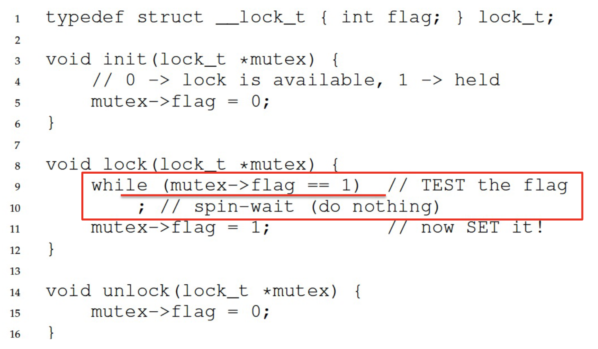
</p>
<p align="center">
  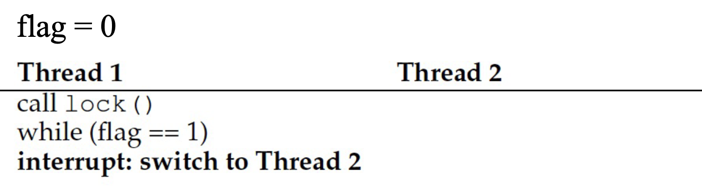
</p>

- Both threads grab the lock!!!
- Lock operation is not atomic! -> No mutual exclusion
- Another problem: performance overhead

#### PETERSON'S SOLUTION
- A software-based solution to the critical section problem
<p align="center">
  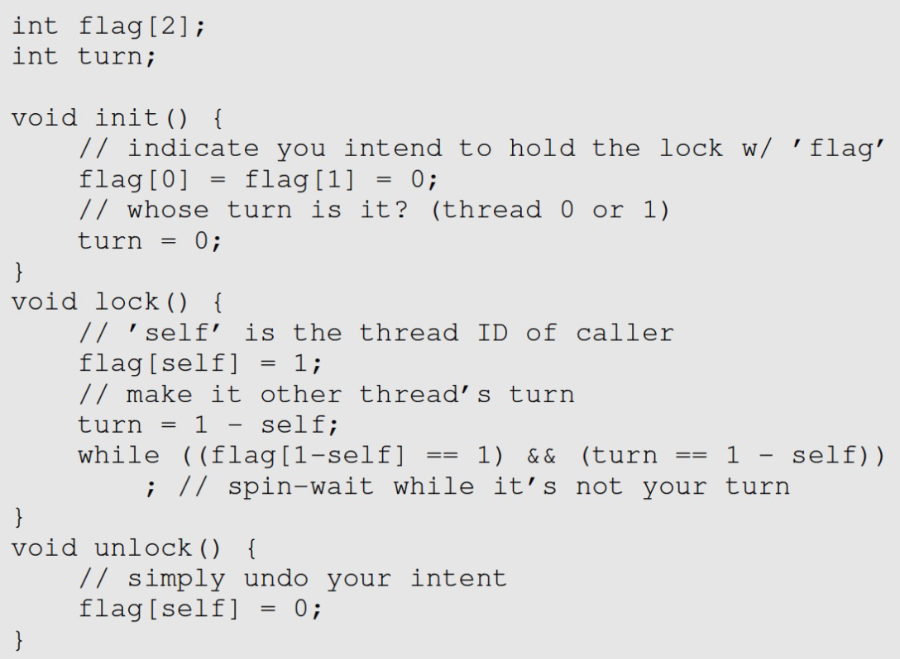
</p>

#### TEST-AND-SET
- How to provide mutual exclusion for locks?
    - Get help from hardware!
- Many machines provide special hardware instructions to help achieve mutual exclusion
- The TestAndSet instruction tests and modifies the content of a memory word atomically
<p align="center">
  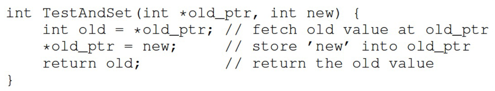
</p>
<p align="center">
  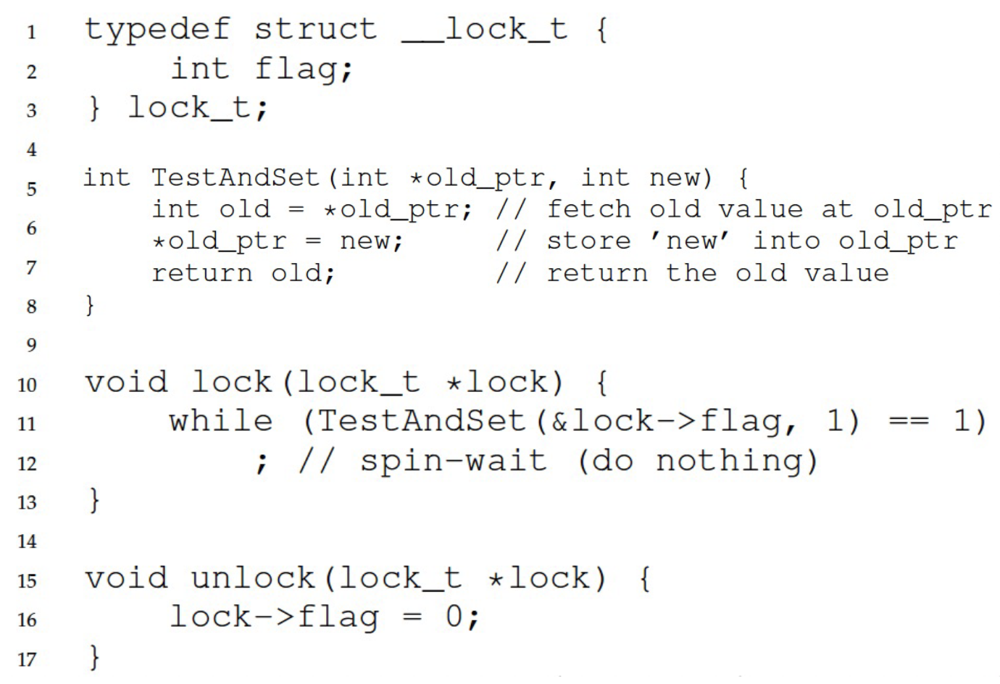
</p>

#### COMPARE-AND-SWAP
- A hardware primitive: compare-and-swap
<p align="center">
  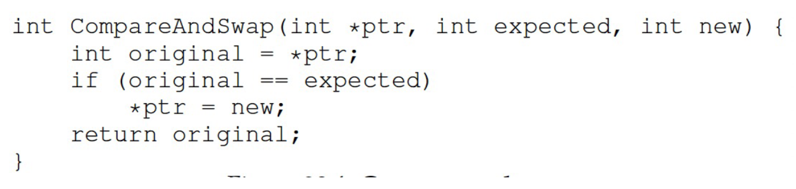
</p>

- Locks with compare-and-swap
<p align="center">
  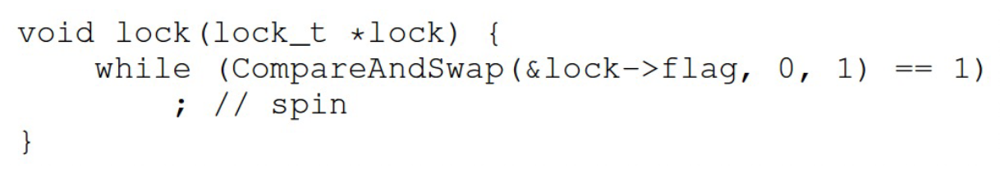
</p>

#### BUSY WAITING
<p align="center">
  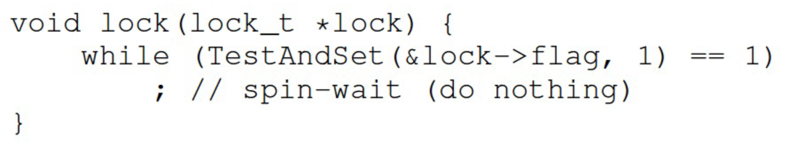
</p>

- This is based on a busy waiting
  - A thread needs to endlessly check the lock value if the lock is held by others
- Lock with busy waiting is called spinlock
- Goals:
  - Mutual exclusion (Y)
  - Fairness (N)
  - Performance (N)

#### SPINLOCKS: UNFAIR

- Basic spinlocks are not fair and may have starvation
<p align="center">
  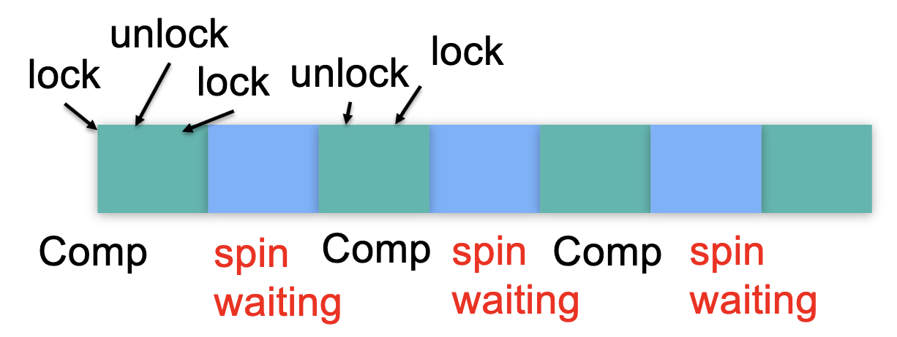
</p>

#### TICKET LOCK
<p align="center">
  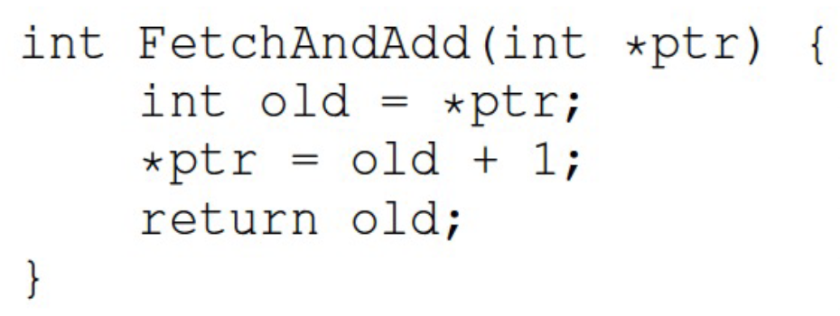
</p>
- A hardware primitive: fetch-and-add
- Lock: ticket and turn
  - Use fetch-and-add on the ticket value
  - The return value is the thread's "turn" value
- Unlock:
  - Increment the turn
- Fairness is guaranteed
<p align="center">
  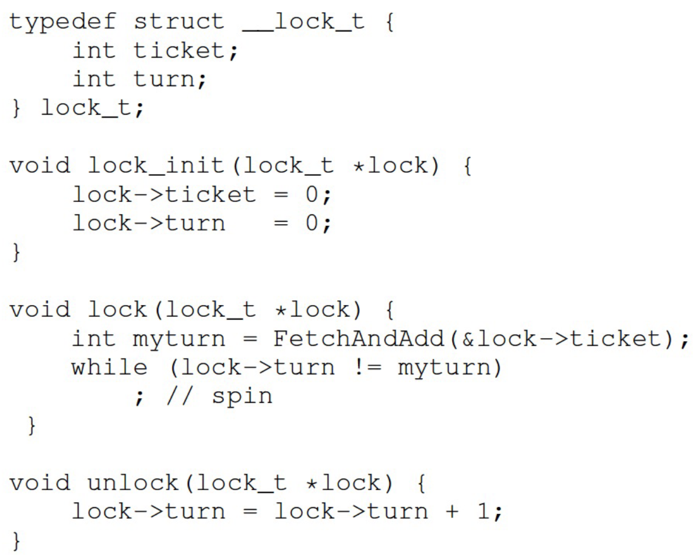
</p>

<p align="center">
  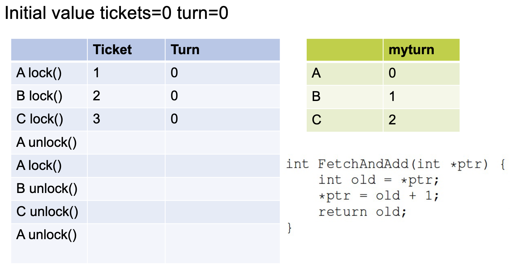
  
  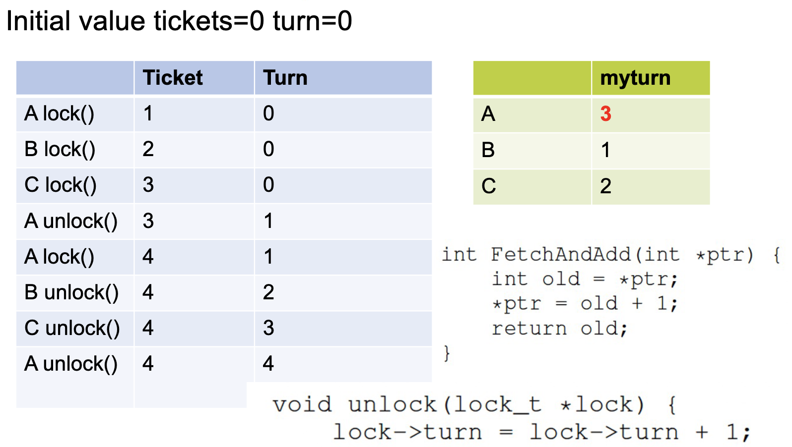
</p>

#### SPINLOCKS: PERFORMANCE
<p align="center">
  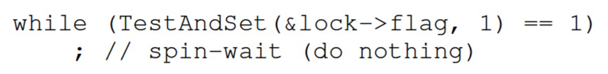
</p>
- Can be fast: 
  - Many CPUs
  - Locks held a short time
  - Pros: No context switch
- But also, can be slow: 
  - One CPU
  - Locks held a long time
  - Cons: Spnning is wasteful

#### SPINLOCKS: ```yield()```
- Instead of spinning, just give up the CPU to another process/thread
<p align="center">
  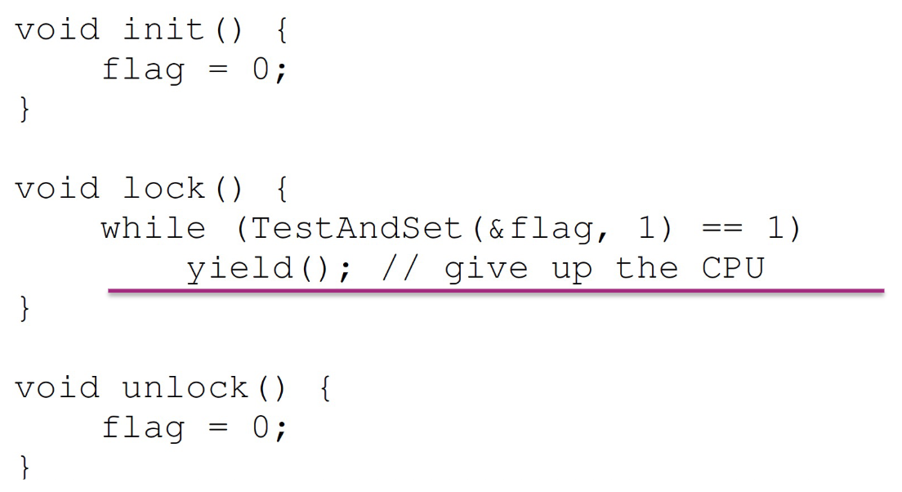
</p>

- Even with ```yield()```, spinning is slow with high thread contention.

#### SPINLOCKS: LOCKS WITH QUEUE
- Locks with queue
  - Sleep and put thread on a queue instead of spinning
- This can guarantee that starvation does not happen as long as all threads wil relinquish locks
- An example from Solaris
  - ```Park()```: put the callong thread to sleep
  - ```Unpark(ThreadID)```: to walk up a specific thread with ThreadID
<p align="center">
  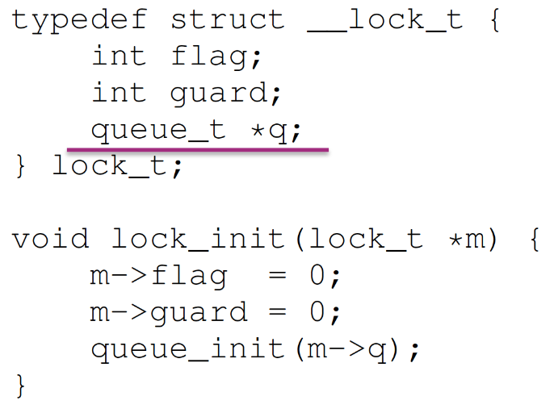
  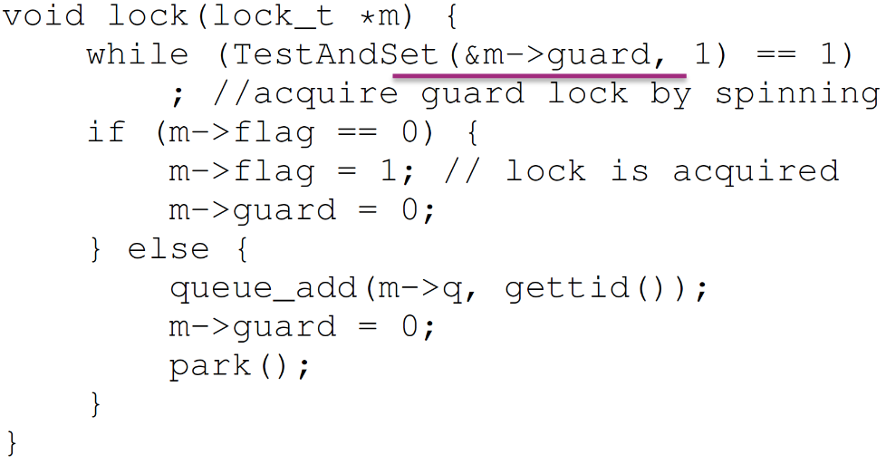
  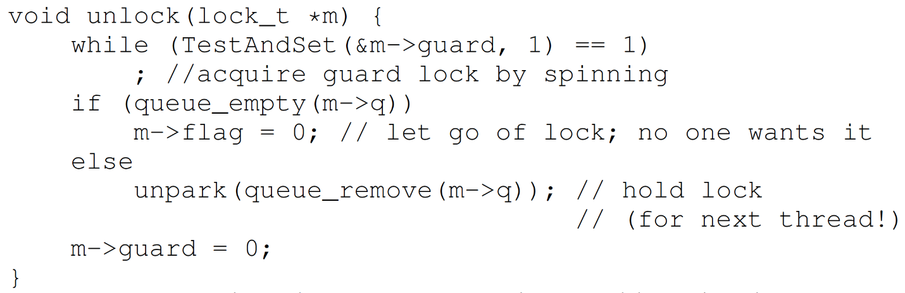
</p>

#### SPINLOCKS: TWO PHADE LOCKS
- Lock released quickly > Spin-wait
- Lock released slowly > Sleep/block
- Two phase lock is a hybrid approach that combines both spin-wait and sleep/block
  - First phase: the lock spins for a while
  - Second phase: if the lock is not acquired in the first phase, put the calling thread to sleep
- Adaptive Mutexes: If a thread has a locked adaptive mutex and the process/thread holding the adaptive mutex is running, the adaptive mutex executes busy waiting. Otherwise, it just blocks the thread.

#### SUMMARY 
- Locks: provide a mutual exclusion
- Spinlocks:
  - Test-And-Set()
  - Compare-And-Swap()
  - Yield()
  - Locks with Queue
  - Two phase locks
  - Adaptive mutex