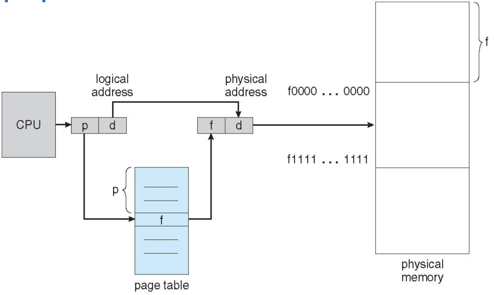
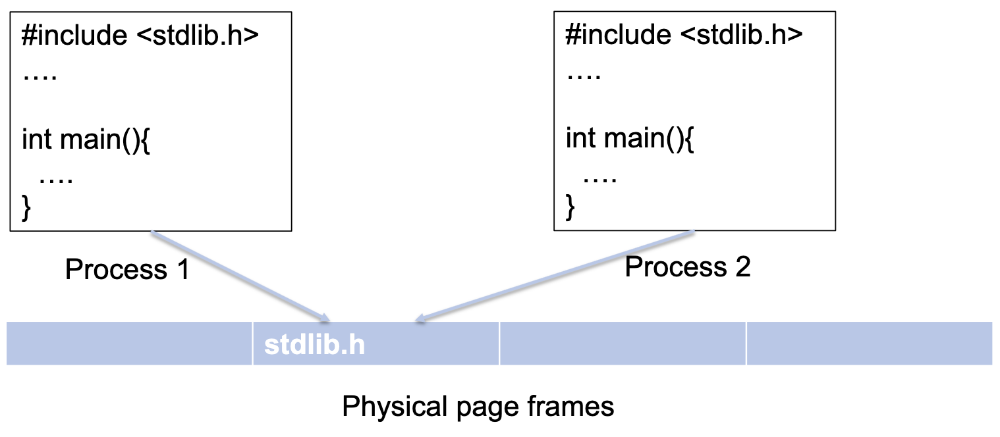

### PAGING 

#### OUTLINES 
- Paging
- Page Translation
- Page Table
- Table Lookaside Buffer (TLB)
- Multi-level paging
- Page Swapping
- Page Replacement

#### PAGING
- Segmentation allows non-contiguous memory assignments
- Segmentation gets memory fragmented (external fragment)
    - Performance overhead (compaction)
- Paging is another method that allows the physical address space of a process to be non-contiguous
- Divide physical memory into fixed-size blocks, called page frames (or simply frame)
- Divide virtual memory into blocks of the same size called pages 
- Flexible mapping pages to frames
- Keep a track of all free frames
- Set up a page table to translate
- Need both OS and Hardware
- No external fragment, but internal fragment
- A 64-byte process is mapped to physical memory
- The page size is 16 bytes

  

- Flexibility: Supporting the abstraction of address space effectively
    - Don't need assumption how heap and stack grow and are used
- Simplicity: Ease of free-space management
    - The page in address space and the page frame are the same size
    - Easy to allocate and keep a free list

#### PAGE TRANSLATION

- A virtual address is split into two parts
    - Virtual page number: used as an index into a page table which contains base address of each page in physical memory
        - High bits to indicate page number
    - Offset: combined with base address to define the physical memory address that is sent to  the memory unit
        - Low bits to indicate offset
- Given virtual address space $2^{m}$ and page size $2^{n}$, **n** bits for offset and **m-n** bits for page number
- Only need to translate the page number to determine where the physical page is
- Offset remains the same
- 32-bit virtual address
- Page size 4KB
- Physical memory 2GB

> How many bits does the offset need? 
> $Log(2^{12})$ for the offset - 12 bits

> And bits for page#? 
> $\frac{2GB}{4KB} = 2^{31-12} = 2^{19}$
> $Log(2^{19})$ for the page number - 19 bits

- Page table:
    - To keep track of the mapping of virtual to physical addresses
    - A per-process data structure

  

- The page table data structure is kept in main memory
- Page-table base register indicates the starting address of page table
- The simplest form of a page table is a linear page table, an array
- Page Table Entry (PTE) includes
    - Translation information
    - Other information

  

- XV6 - 64 bits, each PTE consists of  
    - 44 bits (10 - 53) for physical page number
    - 10 bits (0 - 9 ) for flags, other information

  

#### ADDRESS TRANSLATION

- XV6-SV39:
    - 39-bit virtual address
    - 27 bits to index PTE
    - 12 bits to determine the address within a page frame
    - 39 bits -> 512GB sufficient for RISC-V
- XV6-SV48
    - 48-bit virtual address

  

INVERTED PAGE TABLES
- Keeping a sigle page table that has an entry for each physical page frame of the system
- The entry tells us which process is using this page, and which virtual page of that process maps to this physical page
- Pros: Memory saving
- Cons: Long searching time, page sharing

PAGE SHARING

  

- For per-process page table, let two pages point to the same frame
- For inverted page table, it is difficoult to implement page sharing

ADDRESS TRANSLATION
- The steps of each memory reference
    1. Extract virtual page number from virtual address (memory access)
    2. Calculate address of page table entry
    3. Fetch page table address
    4. Extract physical page frame number
    5. Determine physical address
    6. Fetch physical address to register (memory address)

#### PROBLEMS OF PAGING
- The issue of the introducesd paging mechanism
    - Page table in main memory
    - Fetch the translation from in-memory page table
    - Explicit load/store access on a memory address
- In this scheme every data/instructuon access requires two memory accesses
    - One for the page table
    - and one for the data/instruction
- The performance is affected by a factor of 2!

#### MEMORY ACCESSES OF PAGING

  

#### TABLE LOOKASIDE BUFFER (TLB)
- To speed up the paging translation, hardware helps and builds a cache to store some populat translations
- Translation lookaside buffer (TLB)
    - Part of Memory-management unit (MMU)
    - Hardware cache
- Memory reference with TLB
    - TLB hit: Vitual page number (VPN) is in TLB and can be quickly accessed
    - TLF miss: VPN is not in TLB. Access page table to get the translation, update the TLB entry with the translation

  

  

- Temporal Locality
    - An instruction or data item that has been recently accessed will likely be re-accessed soon in the future
    > 1^{st} access is page 1. 2^{nd} access is also page 1.
- Spatial Locality
    - If a program accesses memory at address *X*, it will likely soon memory near *X*
    > 1^{st} access is page 1. 2^{nd} access is near page 1.

- TLB is a fully associative cache
    - Any given translation can be anywhere in the TLB
    - Hardware searches entire TLB in parallel to find the target
- A typical TLB entry
    VPN|PFN|other bits
    - Valid bit
    - Protection bit
    - Dirty bit

#### TLB ISSUE: CONTEXT SWITCH
- TLB contains translations only valid for current running process
- Switching from one process to another requires OS or hardware to do more work
- How to distinguish which process a TLB entry belongs to
    - Process 1: VPN 10 -> PFN 100
    - Process 2: VPN 10 -> PFN 170

  

- Solution 1: Flush
    - OS flushes the whole TLB on context switch
    - Flush operation sets all valid bit to 0
    - Problem: the overhead is too high if OS switches processes too frequently
- Solution 2: Address space identifier (ASID)
    - Some hardware systems provide an anddress space identifier (ASID) files in the TLB
    - Think of ASID as a process identifier

  

