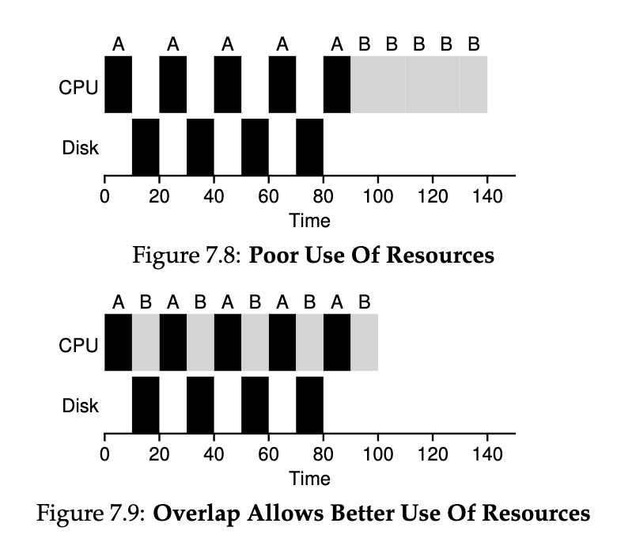
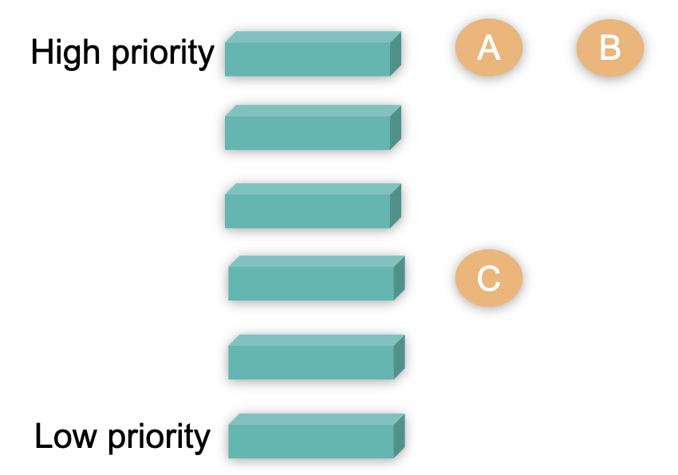
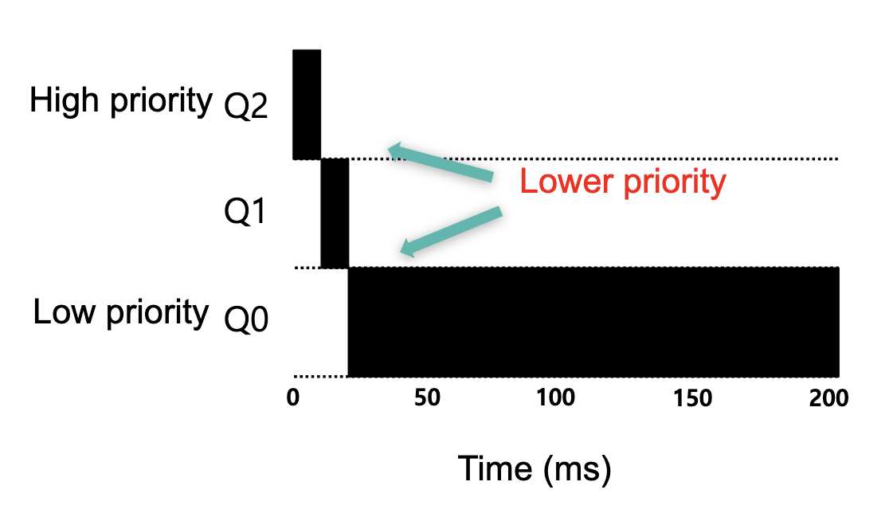
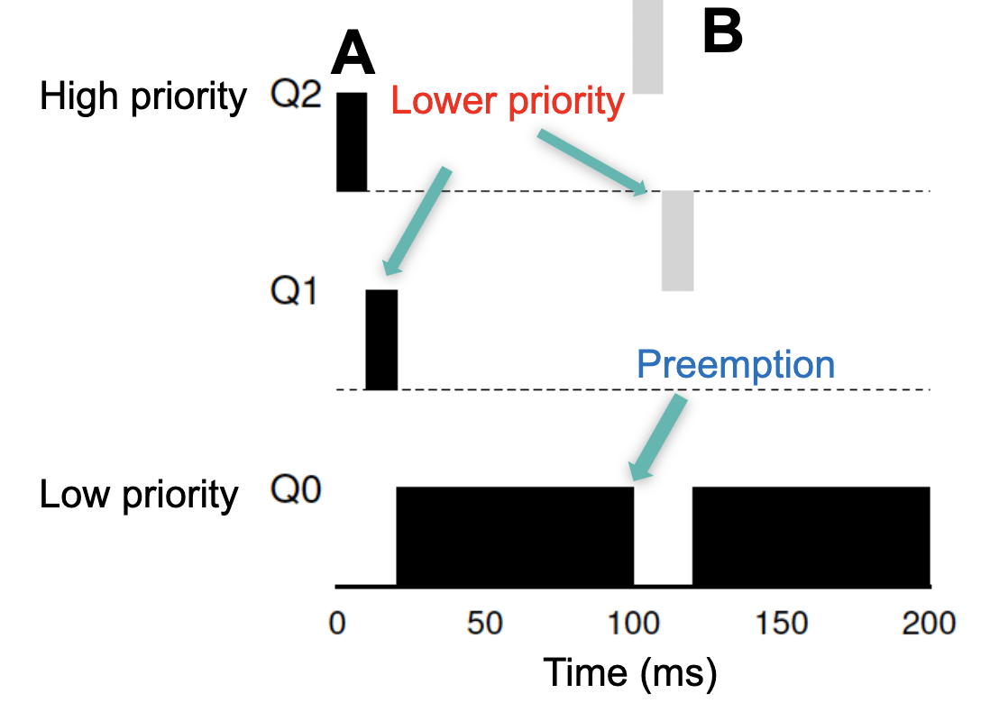
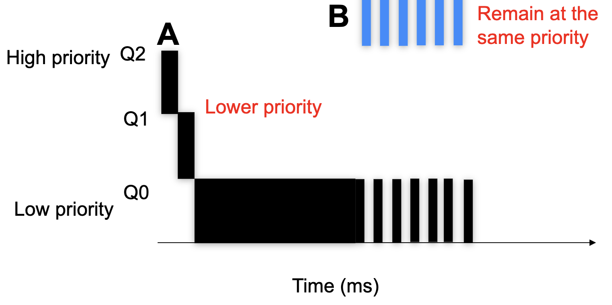

### SCHEDULING

- **Scheduling** is an important problem in many contexts, e.g., logistics, airports, game schedule, etc.
- **Scheduling:** policies that OS employs to determine the execution order of ready processes
- **Scheduling algorithms/schedulers** have diverse objectives and demonstrate different effects on the system performance
- 

#### TERMINOLOGIES
- Schedulin gmetrics and goals:
    - We want to **maximize**:
        - **CPU utilization:** percentage of time CPU is busy exectuing jobs
        - **Throughput:** the number of processes completed in a given amount of time
        - **Fairness:** all processes are likely to be executed
    - We want to **minimize**:
        - **Turnaround time:** the time elapses between the arrival and completion of a process
            - $T_{t} = T_{c} - T_{a}$
        - **Waiting time:** the time a pricess spends in the ready queue
        - **Response time:*** the time elapses between the process' arrival and its first output

#### ASSUMPTIONS FOR WORKLOADS
- Each job runs for the same amount of time
- All jobs arrive at the same time
- All jobs only use the CPU (no I/O)
- Run-time of each job is known
- Once started, each job runs to completion (Preemption)

#### FIRST IN FIRST OUT (FIFO)
- A simple and bassic scheduling algorithm
- First Come First Served (FCFS)
- Jobs are executed in **arrival time order**

    | **Job** | **Arrival time (_s_)** | **Run time (_s_)** |
    |-----|--------------------|----------------|
    | $A$| $0$| $10$|
    | $B$| $0$| $10$|
    | $C$| $0$| $10$|

    A first, B slightly later and then C

- How about FIFO in terms of **turnaround**?
    | **Job** | **Arrival time (_s_)** | **Run time (_s_)** | **Finishing time (_s_)** |
    |-----|--------------------|----------------| ---------------|
    | $A$| $0$| $10$| $10$|
    | $B$| $0^{+}$| $10$| $20$|
    | $C$| $0^{++} $| $10$| $30$|

    > $T_{t} = T_{c} - T_{a}$

    > $A: 10 - 0 = 10$

    > $B: 20 - 0 = 20$

    > $C: 30 - 0 = 30$

    > $\text{Average turnaround time} = \frac{10 + 20 + 30}{3} = 20$

    | **Job** | **Arrival time (_s_)** | **Run time (_s_)** |
    |-----|--------------------|----------------|
    | $A$| $0$| $70$|
    | $B$| $0$| $10$|
    | $C$| $0$| $10$|

    Gives an average turnaround time of 80. How can we minimize this?
    
    > $\text{Average turnaround time} = \frac{70 + 80 + 90}{3} = 80$

- The **convoy effect** is a scheduling phenomenon in which a number of jobs wait for one job to get off a core, causing overall device and CPU utilization to be suboptimal

- Aim to minimize average turnaround time, what is a better scheduling policy for the example above? 

    We take B & C first to get a smaller finishing time, and the AT-time is now reduced.
    
    > $\text{Average turnaround time} = \frac{10 + 20 + 90}{3} = 40$

This way of doing things is called Shortest Job First (SJF)

#### SHORTEST JOB FIRST (SJF)

- Policy: The job with the shortest execution time is scheduled first

    | **Job** | **Arrival time (_s_)** | **Run time (_s_)** | **Finishing time (_s_)** |
    |-----|--------------------|----------------| ---------------|
    | $A$| $0$| $10$| $90$|
    | $B$| $0^{+}$| $10$| $10$|
    | $C$| $0^{++} $| $10$| $20$|

> Remember the assumptions: 
> - All jobs arrive at the same time
> - All jobs only use the CPU (no I/O)
> - Run-time of each job is known
> - Once started, each job runs to completion (Preemption)

If the 4 assumptions hold, SJF is an optimal scheduling algorithm in therms of average waiting time, but if B and C arrive after A we'll still get an AT-time of 80 s. Because even though B and C are ready to run at a certain time, it cannot start unless A is finished. The solution is to remove the assumtion of preemption

### SHORTEST TIME-TO-COMPLETE FIRST (STCF)

>- Once started, each job runs to completion (Preemption)

- This assumption indicates the concepts of preemption
- FIFO and SJF are both non-preemptive schedulers
- STCF policy: Always switch to jobs with the shortest completion time
- STCF is a preemptive scheduler
- STCF is optimal in terms of minimizing the average waiting time, if the remaining assumptions hold. 

    | **Job** | **Arrival time (_s_)** | **Run time (_s_)** | **Finishing time (_s_)** |
    |-----|--------------------|----------------| ---------------|
    | $A$| $0$| $70$| $90$|
    | $B$| $10$| $10$| 20$|
    | $C$| $20$| $10$| $30$|
    > $\text{Average turnaround time} = \frac{90 + 20 + 30}{3} = 47$

- STCF may cause starvation (indefinite blocking)

#### RESPONSE TIME
- Response time is another important performance metric, especially for interactive applications

    | **Job** | **Arrival time (_s_)** | **Run time (_s_)** |
    |-----|--------------------|----------------|
    | $A$| $0$| $30$|
    | $B$| $0^{+}$| $20$|
    | $C$| $0^{++} $| $10$|

    - FIFO : $R = \frac{0 + 30 + 50}{3} = 26.7$
    - SJF : $R = \frac{0 + 10 + 30}{3} = 13.3$

A better scheduler for response time?

#### ROUND-ROBIN (RR)

- A new concept of time quantum/time slice/scheduling quantum: a fixed and small amount of time units
- Each process executes for a time slice
- Switches to another one regardless whether it has completed its execution or not
- If the job har not yet completed its exection, the incomplete job is added to the tail of the ready queue, FIFO queue.

    | **Job** | **Arrival time (_s_)** | **Run time (_s_)** |
    |-----|--------------------|----------------|
    | $A$| $0$| $30$|
    | $B$| $0^{+}$| $20$|
    | $C$| $0^{++} $| $10$|

- Assume that time slice is 5s
    $R = \frac{0 + 5 + 10}{3} = 5$
- If there are **n** processes in the ready queue and the time slice is **q**, no pricess waits more than **(n-1)q** time units.

    | **Job** | **Arrival time (_s_)** | **Run time (_s_)** | **Time quantum** |
    |-----|--------------------|----------------| ---------------|
    | $A$| $0$| $5$| $1$|
    | $B$| $0$| $5$|  |
    | $C$| $0$| $5$|  |

    - RR: $R = \frac{0 + 1 + 2}{3} = 1$
- RR  is a good scheduler in terms of response time...
- but poor in terms of turnaround time
    - FIFO: $T = \frac{5 + 10 + 15}{3} = 10$
    - SJF: $T = \frac{5 + 10 + 15}{3} = 10$
    - RR: $T = \frac{13 + 14 + 15}{3} = 14$
- The selection time of time slice size should be carefully considered (Usually 10-100 milliseconds)
    - Switching between processes come at some overhead, i.e., contect-switch-time
    - Turnaround time depends on the size of time slice. 
- RR is a starvation-free scheduler
    - Some processes never get scheduled, e.g., processes with long execution time in STCF
- RR is fair, simple, and easy to implement and thus is used in modern OSs, such as Linux and MacOS. 
- XV6 implements a simple RR.

#### IMPACT OF CONTEXT SWITCHING
- **Context Switching**: Involves the OS storing and restoring the state (context) of a process or thread, so that execution can be resumed from the same point later.
- **Performance Impact**: Frequent context switching can lead to increased overhead, reducing CPU efficiency. This is particularly evident in algorithms like Round Robin, where the time slice is very short.
- **Balancing Act**: An optimal scheduling algorithm seeks to balance the need for context switching (to ensure fairness and responsiveness) with the overhead it introduces.

#### ADVANCED SCHEDULING CONCEPTS 
- **Dynamic Priority Scheduling**: Priorities of tasks are dynamically adjusted, often used in real-time systems.
- **Multi-Level Queue Scheduling**: Involves multiple queues for processes with different priority levels, allowing more granular control.
- **Real-Time Scheduling**: Ensures that critical real-time processes receive CPU time in a predictable manner, crucial in systems where timing is critical.

#### PRACTICAL CHALLENGES
- **Predicting Job Length**: Algorithms like SJF require prior knowledge of job lengths, which is often impractical.
- **Starvation**: Lower priority jobs in SJF or STCF may experience indefinite delays, known as starvation.
- **Complexity in Dynamic Systems**: Implementing sophisticated algorithms like STCF or dynamic priority scheduling can be complex in systems with varied and unpredictable workloads.

#### OVERVIEW
    
| **Algorithm** | **Pros** | **Cons** |
|-----|--------------------|----------------|
| FCFS/FIFO | Simple fairness  | Poor for short tasks |
|  | Fairness | Poor for I/O intensive tasks |
| SJF | Good for short tasks | Starvation |
|  |  | Known execution time |
| STCF | Good for short tasks | Starvation |
|  | Preemption | Known execution time |
| RR| Response time | Turnaround time |
| | Fairness |  |

| **Algorithm** | **Average Turnaround Time** | **Complexity** | **Context Switch Overhead** | **Best Use Case**           | **Limitations**       |
|---------------|-----------------------------|----------------|-----------------------------|-----------------------------|-----------------------|
| FCFS/FIFO     | Varies                      | Low            | Low                         | Simple, sequential tasks    | Poor for short tasks  |
| SJF           | Optimal for known durations | Moderate       | Low                         | Short, predictable tasks    | Starvation; requires knowing job durations in advance |
| STCF          | Optimal if preemption allowed | High         | Moderate to High            | Dynamic, varied-length tasks | Starvation; complex to implement |
| RR            | High for short time slices  | Moderate       | High                        | Interactive, time-sharing systems | Inefficient for long tasks; depends on time slice size |

#### XV6 SCHEDULER
- Scheduler is implemented as an individual kernel thread
    - To schedule a new task, it needs to first switch the scheduler thread
- Two functions
    - **sched()**
        - Check the various conditions in **yield()**, **exit()**, and **sleep()**
        - Hand the controll over to the scheduler function
    - **scheduler()**
        - Select a runnable process to execute
        - Per-CPU core thread. i.e., each CPU has one scheduler
- Context-switch
    - **swtch(struct contect \*old, struct contect \*new)**
        - Save the old context and load the new context
     
#### INCORPORATING I/O

- In realistic scenarios, jobs require both CPU processing and I/O operations. This breaks the assumption that jobs only use the CPU.
- A job's execution alternates between CPU bursts (active computation) and I/O bursts (waiting for I/O operations).
- CPU scheduling can be thought of as managing these CPU bursts as sub-jobs:
  - When a CPU burst completes, initiate the corresponding I/O burst.
  - While a process waits for I/O, the CPU can switch to another process.

>Run-time of each job is known

  

#### PRIORITY-BASED SCHEDULING
No we remove the last assumption
- Moving away from simpler models, priority-based scheduling introduces a priority level for each process, influencing the scheduling order.
- Processes are selected based on priority, with various algorithms available for preemptive or non-preemptive execution.
- Priorities can be assigned through different methods and often, a lower numerical value represents a higher priority.
- One challenge with priority-based scheduling is the potential for starvation, where lower priority processes may never execute if higher priority processes continuously arrive.

    | **Process** | **Burst time** | **Priority** |
    |-----|--------------------|----------------|
    | $P_{1}$| $10$| $3$|
    | $P_{2}$| $1$| $1$|
    | $P_{3}$| $2$| $4$|
    | $P_{4}$| $1$| $5$|
    | $P_{5}$| $5$| $2$|

    In this case we don't care about the burst time, priority is the only thing that matters.

#### MULTI-LEVEL FEEDBACK QUEUE (MLFQ)

- **SJF and STCF Trade-offs**: Shortest Job First (SJF) and Shortest Time to Completion First (STCF) prioritize jobs with the shortest duration for execution, leading to excellent turnaround times. However, this approach often results in poor response times for longer jobs.
  
- **RR for Responsiveness**: Round Robin (RR) scheduling enhances response time by rotating execution among processes in a time-shared manner, but it can extend the turnaround time, especially for processes that are ready to run.

- **MLFQ's Approach**: MLFQ is engineered to strike a balance between minimizing turnaround time and maximizing response time efficiency. It achieves this by dynamically adjusting process priorities based on their execution history and behavior.

- **Combining Strategies**: MLFQ integrates the concepts of priority-based scheduling with the fairness of Round Robin (RR). It manages multiple queues, each representing a different priority level, with processes within the same queue being treated with equal priority.

- **Operational Rules**:
  - **Rule 1**: A process with higher priority (lower numerical value) preempts one with lower priority.
  - **Rule 2**: Processes with equal priority are scheduled using RR.
  - **Rule 3**: Newly introduced jobs are placed at the highest priority level.
  - **Rule 4a**: Consuming a full time slice results in a priority demotion (moving to a lower-priority queue).
  - **Rule 4b**: Releasing the CPU voluntarily (before using up the time slice) retains the process's current priority level.

  

- **Dynamic Priority Adjustment**: Unlike fixed-priority scheduling, MLFQ adjusts a job's priority based on its observed behavior—prioritizing interactive jobs that often wait for I/O operations, and computation-heavy jobs that utilize full CPU bursts.

**EXAMPLE WITH ONE JOB**
- Rule 3 and 4a (starts at the highest, and lower if not finished)
- A long running job; Time slice is 10ms.

  

**EXAMPLE WITH TWO JOBS**
- **Job A:** A long-running CPU-intensive job
- **Job B:** A short-running interactive job (20ms runtime), arrives at 100ms. 

  

**EXAMPLE WITH ONE JOB**
- Rule 4b (stays at the same priority)
- **Job A:** A long-running CPU-intensive job
- **Job B:** An interactive job that only needs CPU for 5 ms before I/O.

  

-  What are the problems of the durrent MLFQ?
    - Starvation: higher priority jobs always occupy the CPU -> lower priority jobs are stuck in the queue. To prevent this, we implement a new rule; 
        >**Rule 5**: After some time S, move all jobs in the system to the topmost queue. This can help against starvation.  
    - Game the scheduler: Task gives up CPU just before the end of a time slice
        - Some sneaky tricks to get more resource share
        > Combine **Rule 4a** and **Rule 4b** into **Rule 4::** Once a job uses up its time allotment at a given level (regardless of how many times it has given up the CPU), its priority is reduced(i.e., it moves down one queue).
    - Changed behavior over time

- The refined set of MLFQ rules:
    - Rule 1: If Priority(A) > Priority(B), A runs (B doesn’t).
    - Rule 2: If Priority(A) = Priority(B), A & B run in RR.
    - Rule 3: When a job enters the system, it is placed at the highest priority.
    - Rule 4: Once a job uses up its time allotment at a given level (regardless of how many times it has given up the CPU), its priority is reduced (i.e., it moves down on queue).
    - Rule 5: After some time period S, move all the jobs in the system to the topmost queue.

- Beauty of MLFQ
    - It does not require prior knowledge on the CPU usage of a process.

- MLFQ scheduler is defined by the following parameters
    - Number of queues
    - Time slice of each queue
    - Boosting period
    - Schedueling algorithms for each queue
    - etc.
- High priority queue: 
    - Interactive processes
    - Response time
- Low priority queue:
    - Batch processes (CPU-intensive)
    - Turnaround time

#### FAIRNESS
- To guarantee the fair usage of CPU (CPU time)

  

- If RR, A gets 75% and B only getrs 25% 
- If B is higher priority, A may get starved

#### PROPORTIONAL SHARE SCHEDULING
- Fair-share scheduler
    - Guarantee that each job obtains a *certain percentage* of CPU time.
    - Not optimized for turnaround or response time
- Lottery scheduling
    - Based on the concept of tickets
        - The percentage of tickets denotes the share of a resource for a process
    - There are two processes, A and B, and 100 tickets in total.
        - Process A har 75 tickets -> receives 75% of the CPU
        - Process B har 25 tickets -> receives 25% of the CPU
- A probabilistic way to implement lottery scheduling
    - Time slice (like in RR)
    - Scheduler knows how many tickets exist
    - Scheduler picks a winning ticket from the ticket pool for each time slice

#### TICKET MECHANISMS
- Ticket currency: Allocate tickets among the tasks of a user or group
    - Global currency
    - Ticket currency
- Ticket transfer: Temporarily hand off tickets to another task
    - Boost the executionf of the task that receives tickets
- Ticket inflation: Dynamically change the number of tickets

#### COMPLETELY FAIR SCHEDULING (CFS)
- The current CPU scheduler in Linux
- Choose the process with the lowest execution time: *vruntime*
- Run the process for a time slice
- Non-fixed time slice:
    - CFS alligns time slice based on sched_latency and the number of processes
- Priority
    - Enables control over priority by using nice value, user-space value.
    - -20 - 19, default 0, positive lower priority, negative higher priority
- Efficient data structure
    - Use red-black tree for efficient search, insertion and deletion of a process.
- Virtual runtime (vruntime)
    - Denotes how long the process has executed.
    - Per-process variable
    - Increases in proportion with physical (real) time when it runs.
    - CFS pick the process with the lowest vruntime to run next
- sched_latency
    - Used to determine the time slice
    - A typical value is 48ms
    - process's time slice = sched_latency / #processes
        - N = 4, time slice = 12 ms
        - N = 2, time slice = 24 ms
        - What if N = inf -> Set the minimum time slice value to 6ms
- CFS deploys a red-black tree
    - Balanced binary search tree
    - Ordered by vruntime as key
    - Complexity:
        - insertion, deletion, update -> $O(n \log {}n)$ 
        - find min -> $O(1)$ 

    

#### SUMMARY
- There are different metrics to evaluate the performance of scheduling algorithms
- FIFO is a simple scheduler, but suffers from the convoy effect. 
- SJF is an optimal scheduling algorithm in terms of minimizing average waiting time, if all jobs start simultaneously and know their execution time in prior.
- STCF is an optimal scheduling algorithm in terms of minimizing average turnaround time, if all jobs know thes execution times in prior. 
- RR is a better algorithm in terms of minimizing average response time. 

In conclusion, scheduling algorithms play a critical role in optimizing CPU utilization and system performance. While algorithms like FIFO are simple and fair, they might not be efficient for systems with varied job lengths. SJF and STCF provide optimal solutions for certain conditions but face challenges like starvation and the need for job length prediction. Round Robin offers fairness and responsiveness at the expense of turnaround time. Advanced scheduling concepts attempt to address these limitations but introduce complexity. The choice of a scheduling algorithm depends on the specific requirements and constraints of the system in question.

